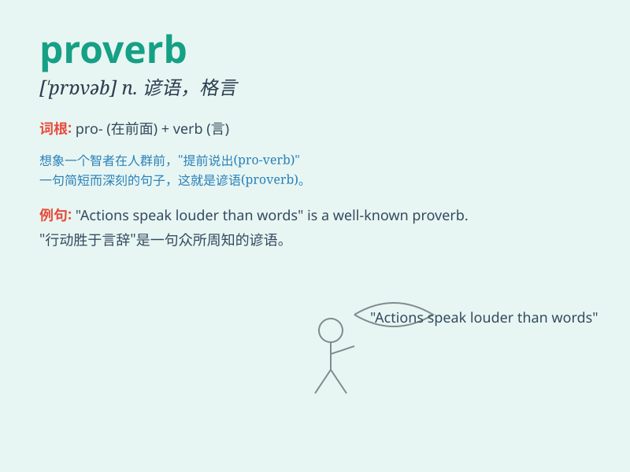

## proverb

**英音:** _[\'prɒvɜːb]_ **美音:** _[\'prɑvɝb]_

**译义:** *n.谚语*

### 短语

+ **English proverb:** _英语谚语_

+ **famous proverb:** _著名的谚语_

+ **ancient proverb:** _古老的谚语_

+ **common proverb:** _常见的谚语_

+ **proverb saying:** _谚语说法_

### 例句

#### 例句1

> **As the proverb goes, \'A bird in the hand is worth two in the
bush.\'**

**中文翻译:** 俗话说："一鸟在手胜过二鸟在林。"

**单词释义:** 谚语；格言

#### 例句2

> **This proverb holds true in many situations.**

**中文翻译:** 这句谚语在很多情况下都适用。

**单词释义:** 谚语；格言

#### 例句3

> **He often quotes proverbs to support his arguments.**

**中文翻译:** 他经常引用谚语来支持他的论点。

**单词释义:** 谚语；格言

### 背诵小故事

> A young student was always confused in class. One day, the teacher
told him a proverb: \'A stitch in time saves nine.\' The student
understood that timely action could prevent bigger problems. From then
on, he remembered the word \'proverb\' as wise sayings that teach
lessons.

**一个年轻的学生在课堂上总是感到困惑。有一天，老师告诉他一句谚语：'及时一针省九针。'学生明白了及时行动可以防止更大的问题。从那时起，他记住了'proverb'这个词是指教导道理的睿智话语。**

### 图义

