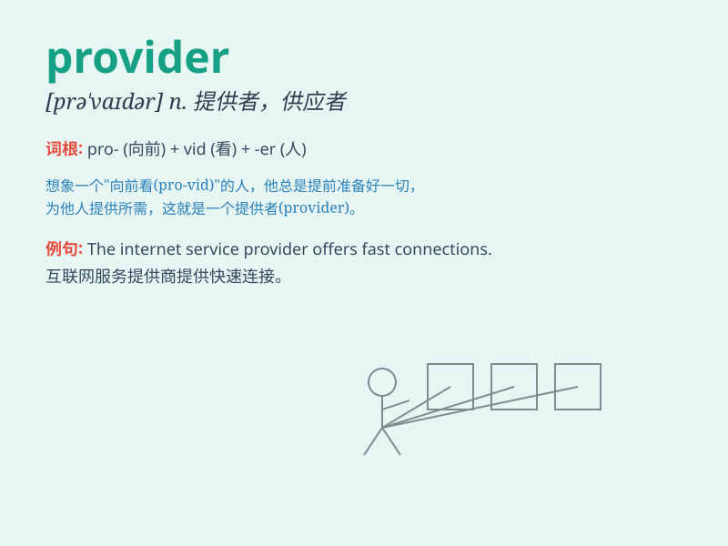

## provider

**英音:** _[prə\'vaɪdə]_ **美音:** _[prə\'vaɪdɚ]_

**译义:** *n.供给者,供应者,养家者*

### 短语

+ **service provider:** _服务提供商_

+ **content provider:** _内容提供商_

+ **data provider:** _数据提供商_

+ **internet provider:** _互联网服务提供商_

+ **energy provider:** _能源供应商_

### 例句

#### 例句1

> **The internet provider is experiencing technical difficulties.**

**中文翻译:** 互联网提供商遇到技术困难。

**单词释义:** 服务提供商

#### 例句2

> **She is a reliable provider of information.**

**中文翻译:** 她是一位可靠的信息提供者。

**单词释义:** 提供者

#### 例句3

> **The local provider of fresh produce has the best quality
goods.**

**中文翻译:** 当地的新鲜农产品供应商拥有最优质的商品。

**单词释义:** 供应商

### 背诵小故事

>
想象一个小镇，人们生活所需的各种物品都依赖一位神秘的提供者。他总是能及时送来食物、水和药品。这位提供者就是
provider，默默保障着大家的生活。

**想象一个小镇，其中人们生活所需的各种物品都依赖一位神秘的供应者。他总是能及时送来食物、水和药品。这位供应者就是
provider，默默保障着大家的生活。**

### 图义

