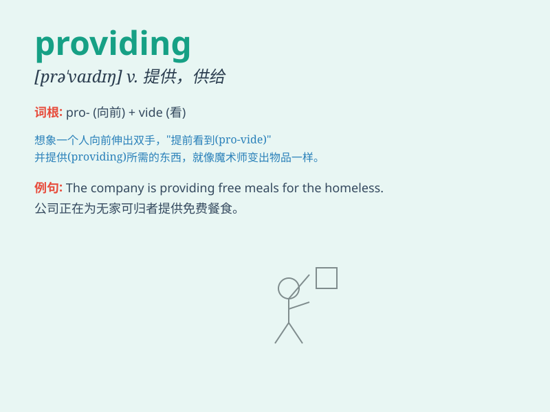

## providing

**英音:** _[prə\'vaɪdɪŋ]_ **美音:** _[prə\'vaɪdɪŋ]_

**译义:** *conj.倘若*

### 短语

+ **providing that:** _假如；倘若_

+ **providing for:** _为\...做准备；供养_

+ **providing with:** _向\...提供；供给_

+ **subject to providing:** _取决于提供_

+ **in providing:** _在提供方面_

### 例句

#### 例句1

> **I\'ll help you, providing I have the time.**

**中文翻译:** 只要有时间我就会帮你。

**单词释义:** 假如；倘若；在......条件下

#### 例句2

> **Providing that you have the money in your account, you can
withdraw up to \$1000 a day.**

**中文翻译:** 如果您的账户中有钱，您每天最多可以提取 1000 美元。

**单词释义:** 假如；如果

#### 例句3

> **The company will deliver the goods providing the payment is made
in advance.**

**中文翻译:** 只要提前付款，公司就会发货。

**单词释义:** 倘若；只要

### 背诵小故事

> Once upon a time, a little bird was lost. But providing it had the
courage and determination, it finally found its way home. \'Providing\'
here means on the condition that or as long as.

**从前，一只小鸟迷路了。但只要它有勇气和决心，最终就能找到回家的路。这里的'providing'意思是假如；倘若；在......条件下；只要。**

### 图义

