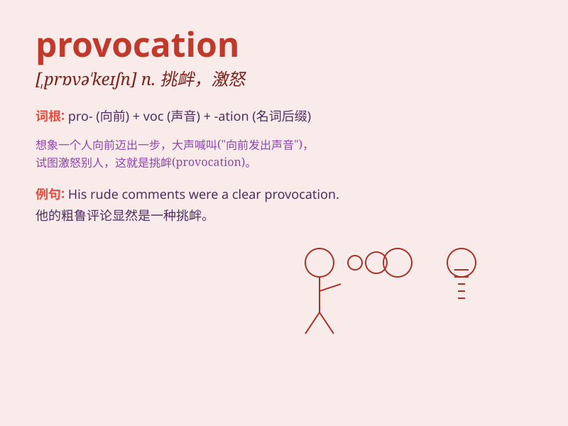

## provocation

**英音:** _[,prɒvə\'keɪʃ(ə)n]_ **美音:**
_[,prɑvə\'keʃən]_

**译义:** *n.激怒,刺激,挑衅,挑拨*

### 短语

+ **act of provocation:** _挑衅行为_

+ **bear provocation:** _忍受挑衅_

+ **deliberate provocation:** _蓄意挑衅_

+ **respond to provocation:** _回应挑衅_

+ **under provocation:** _在受挑衅的情况下_

### 例句

#### 例句1

> **His constant provocation made me lose my temper.**

**中文翻译:** 他不断的挑衅让我发脾气。

**单词释义:** 挑衅；激怒

#### 例句2

> **The soldier remained calm in the face of enemy provocation.**

**中文翻译:** 面对敌人的挑衅，这名士兵保持冷静。

**单词释义:** 挑衅；挑拨

#### 例句3

> **She couldn\'t resist the provocation and responded angrily.**

**中文翻译:** 她无法抗拒这种挑衅，愤怒地回应。

**单词释义:** 挑衅；刺激

### 背诵小故事

> A monkey was teasing a lion constantly, throwing fruits at it. This
constant teasing was a provocation. The lion finally got angry and
roared loudly. The monkey\'s actions were clearly meant to stir up the
lion\'s anger.

**一只猴子不停地戏弄狮子，朝它扔水果。这种持续的戏弄就是挑衅。狮子最后生气了，大声吼叫。猴子的行为显然是为了激起狮子的怒火。**

### 图义

