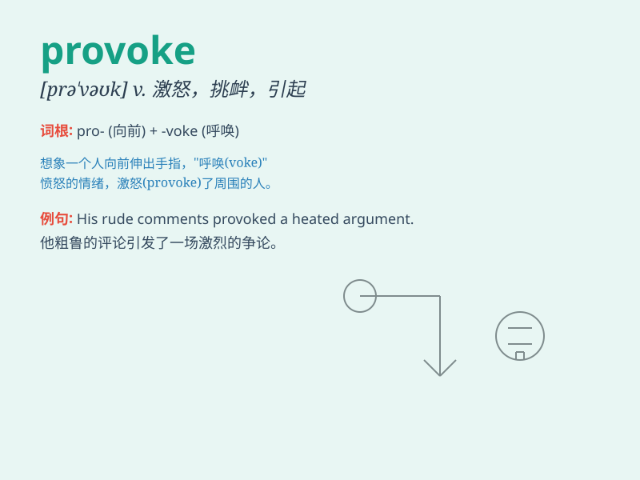

## provoke

**英音:** _[prə\'vəʊk]_ **美音:** _[prə\'vok]_

**译义:** *vt.激怒,挑拨,煽动,惹起,驱使*

### 短语

+ **provoke anger:** _激起愤怒_

+ **provoke a reaction:** _引起反应_

+ **provoke controversy:** _挑起争议_

+ **provoke thought:** _激发思考_

+ **provoke violence:** _引发暴力_

### 例句

#### 例句1

> **His constant teasing provoked her to anger.**

**中文翻译:** 他不断的戏弄让她生气。

**单词释义:** 激起，引发

#### 例句2

> **The new law has provoked widespread protests.**

**中文翻译:** 新法律引发了广泛的抗议。

**单词释义:** 引起，激起

#### 例句3

> **Don\'t provoke the dog; it may bite you.**

**中文翻译:** 不要激怒狗；它可能会咬你。

**单词释义:** 招惹，挑衅

### 背诵小故事

> A naughty monkey was constantly teasing a big lion, making funny
faces and pulling its tail. This behavior finally provoked the lion, and
it roared angrily. The monkey\'s actions led to the lion\'s rage, and
that\'s what \'provoke\' means.

**一只顽皮的猴子不停地戏弄一头大狮子，做鬼脸并拽它的尾巴。这种行为最终激怒了狮子，它愤怒地咆哮起来。猴子的行为引发了狮子的愤怒，这就是\'provoke\'的意思。**

### 图义

