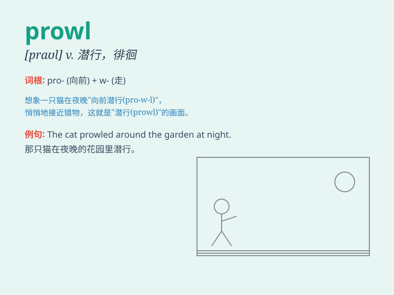

## prowl

**英音:** _[praʊl]_ **美音:** _[praʊl]_

**译义:** *v.巡游*

### 短语

+ **on the prowl:** _在潜行；在寻觅_

+ **prowl around:** _四处徘徊；到处潜行_

+ **prowl through:** _潜行穿过；悄悄搜寻_

+ **be out on the prowl:** _外出寻觅；外出潜行_

+ **prowl for prey:** _潜行寻找猎物_

### 例句

#### 例句1

> **The tiger was seen prowling through the jungle at night.**

**中文翻译:** 有人看到老虎在夜间在丛林中徘徊。

**单词释义:** 悄悄地徘徊；潜行

#### 例句2

> **Thieves prowl the streets at night looking for easy targets.**

**中文翻译:** 小偷在夜间在街道上徘徊，寻找容易下手的目标。

**单词释义:** 悄悄巡行（以寻找或等待做某事的机会）

#### 例句3

> **He prowled around the house, unable to sleep.**

**中文翻译:** 他在房子里转来转去，无法入睡。

**单词释义:** 来回走动；游荡

### 背诵小故事

> A thief was prowling around the quiet neighborhood at night. He moved
stealthily, looking for an unlocked door. But a vigilant dog started
barking and scared him away. \'Prowl\' means to move around quietly and
secretly, often with bad intentions.

**一个小偷在夜晚悄悄地在安静的街区徘徊。他偷偷摸摸地移动，寻找未锁的门。但一只警惕的狗开始狂吠，把他吓跑了。\'prowl\'意思是悄悄地、秘密地四处走动，通常怀有不良意图。**

### 图义

