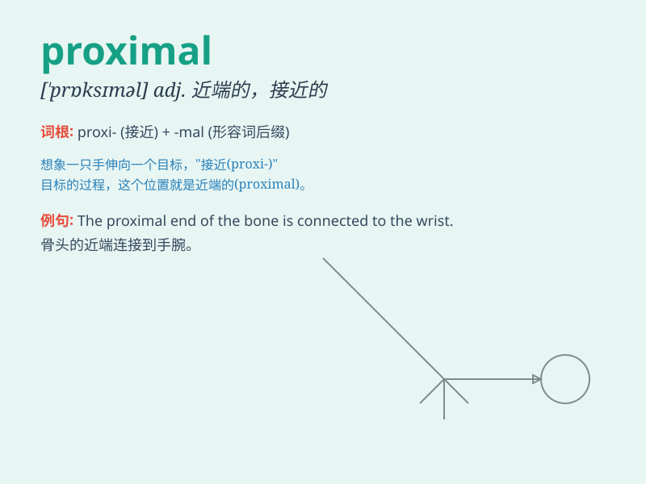

## proximal

**英音:** _[\'prɒksɪm(ə)l]_ **美音:** _[\'prɑksɪməl]_

**译义:** *adj.最接近的*

### 短语

+ **proximal end:** _近端_

+ **proximal cause:** _近因_

+ **proximal tubule:** _近曲小管_

+ **proximal contact:** _邻面接触_

+ **proximal surface:** _近中面_

### 例句

#### 例句1

> **The proximal end of the bone was fractured.**

**中文翻译:** 骨头的近端骨折。

**单词释义:** 靠近的；最接近的

#### 例句2

> **The proximal cause of the problem needs to be identified.**

**中文翻译:** 需要确定问题的最直接原因。

**单词释义:** 接近的；临近的

#### 例句3

> **The proximal tooth was affected by the infection.**

**中文翻译:** 近端牙齿受到感染。

**单词释义:** 邻近的；接近的

### 背诵小故事

>
想象一个探险家在深山里迷路了，他努力寻找出路。突然，他发现了一条离他最近的（proximal）小路，仿佛是命运的指引，最终顺着这条小路走出了困境。

**想象一位探险家在山中迷路，发现离他最近的小路并借此脱困的故事来辅助记忆\'proximal\'（最接近的；邻近的）这个单词**

### 图义

