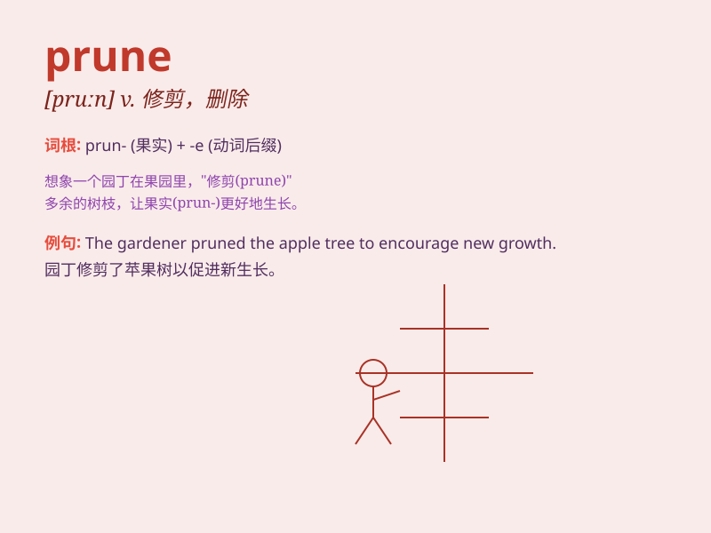

## prune

**英音:** _[pruːn]_ **美音:** _[prun]_

**译义:** *v.剪除*

### 短语

+ **prune away:** _修剪掉；删减_

+ **prune back:** _修剪；削减_

+ **prune down:** _删减；削减_

+ **prune off:** _剪去；截去_

+ **prune tree:** _修剪树木_

### 例句

#### 例句1

> **She pruned the roses carefully to encourage new growth.**

**中文翻译:** 她仔细修剪玫瑰以促进新的生长。

**单词释义:** 修剪

#### 例句2

> **The company decided to prune its staff to reduce costs.**

**中文翻译:** 该公司决定裁员以降低成本。

**单词释义:** 裁减

#### 例句3

> **He needs to prune his spending habits to save more money.**

**中文翻译:** 他需要改变自己的消费习惯以存更多的钱。

**单词释义:** 削减

### 背诵小故事

> A man was pruning the branches of a tree. He cut off the unnecessary
parts to make the tree look better and healthier. Just like \'prune\'
means to cut or trim something to improve it.

**一个男人正在修剪一棵树的树枝。他剪掉不必要的部分以使树看起来更好更健康。就像\'prune\'这个单词意思是剪掉或修整某物以改进它。**

### 图义

