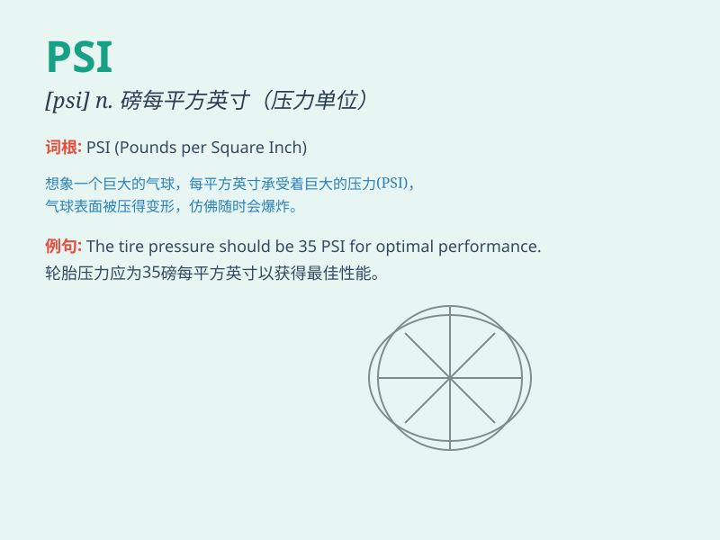

## PSI

**英音:** _[paɪ es aɪ]_ **美音:** _[paɪ es aɪ]_

**译义:** *n. 压力单位（Pounds per Square
Inch）；心理状态指数（Psychological Stress
Indicator）；希腊字母表的第23个字母（Ψ）*

### 短语

+ **PSI value:** _PSI 值_

+ **PSI level:** _PSI 水平_

+ **PSI measurement:** _PSI 测量_

+ **PSI indicator:** _PSI 指示器_

+ **PSI system:** _PSI 系统_

### 例句

#### 例句1

> **The pressure is measured in PSI.**

**中文翻译:** 压力以磅力每平方英寸来测量。

**单词释义:** 磅力每平方英寸（一种压力单位）

#### 例句2

> **The tire should be inflated to 32 PSI.**

**中文翻译:** 轮胎应该充气到 32 磅力每平方英寸。

**单词释义:** 磅力每平方英寸（表示轮胎的充气压力值）

#### 例句3

> **The PSI reading on the gauge shows the system is operating
normally.**

**中文翻译:** 仪表上的磅力每平方英寸读数表明系统运行正常。

**单词释义:** 磅力每平方英寸（用于描述仪表上的压力数值）

### 背诵小故事

> A scientist was studying pressure and found a special unit called
PSI. He used it to measure the force exerted on a small area. With PSI,
his experiments became more accurate and his research was a big success.

**一位科学家在研究压力时发现了一个特殊的单位叫
PSI。他用它来测量作用在小面积上的力。有了
PSI，他的实验变得更精确，研究取得了巨大成功。**

### 图义

