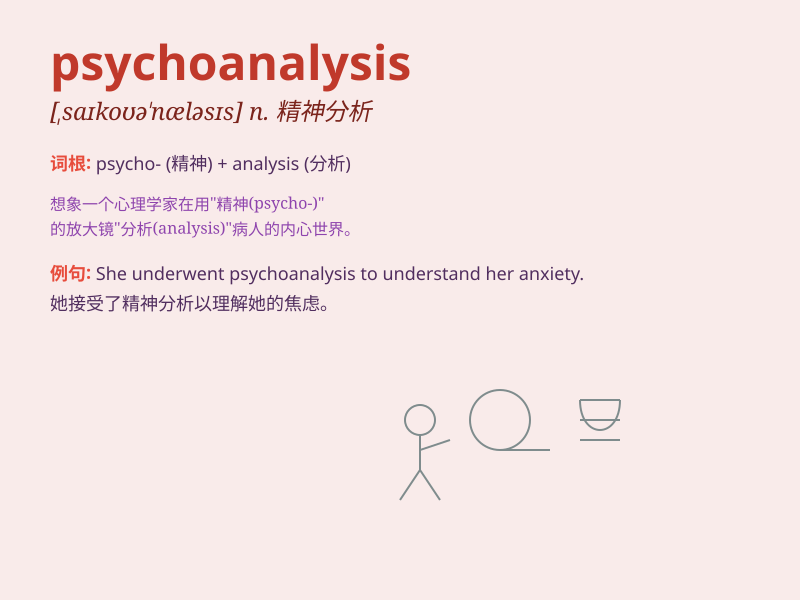

## psychoanalysis

**英音:** _[,saɪkəʊə\'nælɪsɪs]_ **美音:**
_[\'saɪkoə\'næləsɪs]_

**译义:** *n.心理分析*

### 短语

+ **psychoanalysis theory:** _精神分析理论_

+ **undergo psychoanalysis:** _接受精神分析_

+ **psychoanalysis session:** _精神分析疗程_

+ **depth psychoanalysis:** _深度精神分析_

+ **psychoanalysis approach:** _精神分析方法_

### 例句

#### 例句1

> **She underwent psychoanalysis to deal with her childhood
traumas.**

**中文翻译:** 她接受了精神分析来应对童年的创伤。

**单词释义:** 精神分析

#### 例句2

> **The professor specialized in psychoanalysis of literary
works.**

**中文翻译:** 这位教授专门研究文学作品的精神分析。

**单词释义:** 精神分析

#### 例句3

> **Psychoanalysis has helped many people understand their
subconscious thoughts.**

**中文翻译:** 精神分析帮助许多人了解他们的潜意识想法。

**单词释义:** 精神分析

### 背诵小故事

> A patient was in a deep confusion. A wise doctor used psychoanalysis
to explore his hidden thoughts. By uncovering the patient\'s
subconscious, the doctor helped him find inner peace and solve problems.

**一位病人深陷困惑之中。一位睿智的医生运用精神分析来探寻他隐藏的想法。通过揭示病人的潜意识，医生帮助他找到了内心的平静并解决了问题。**

### 图义

