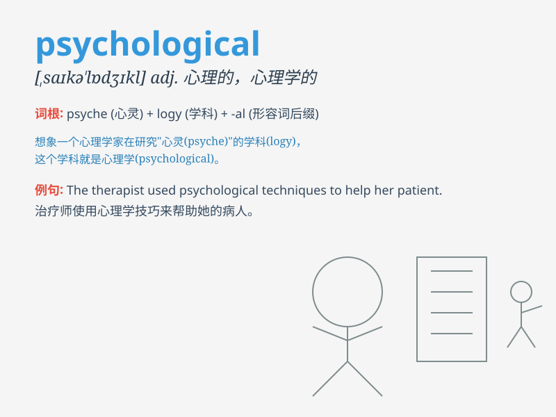

## psychological

**英音:** _[saɪkə\'lɒdʒɪk(ə)l]_ **美音:**
_[,saɪkə\'lɑdʒɪkl]_

**译义:** *adj.心理(上)的*

### 短语

+ **psychological disorder:** _心理障碍；心理失调_

+ **psychological test:** _心理测验_

+ **psychological impact:** _心理影响_

+ **psychological counseling:** _心理咨询_

+ **psychological warfare:** _心理战_

### 例句

#### 例句1

> **The psychological impact of the disaster was significant.**

**中文翻译:** 灾难的心理影响是巨大的。

**单词释义:** 心理的

#### 例句2

> **She has a background in psychological research.**

**中文翻译:** 她拥有心理学研究背景。

**单词释义:** 心理学的

#### 例句3

> **The psychological test showed some interesting results.**

**中文翻译:** 心理测试显示了一些有趣的结果。

**单词释义:** 心理的

### 背诵小故事

> A brave scientist was studying psychological phenomena. He faced many
challenges but never gave up. His research helped people understand
their inner thoughts and feelings. Remember, \'psychological\' is about
the mind and emotions!

**一位勇敢的科学家正在研究心理现象。他面临许多挑战但从未放弃。他的研究帮助人们理解他们内心的想法和感受。记住，\'psychological\'
是关于心理和情感的！**

### 图义

