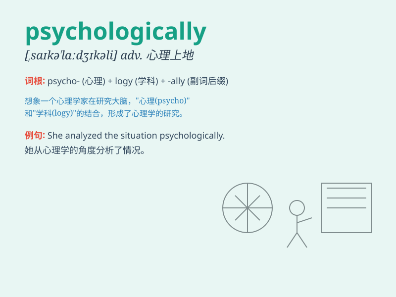

## psychologically

**英音:** _[saɪ\'kɒlədʒɪklɪ]_ **美音:**
_[saɪkə\'lɑdʒɪkli]_

**译义:** *adv.心理上地,心理学地*

### 短语

+ **psychologically vulnerable:** _心理上脆弱的_

+ **psychologically prepared:** _心理上有准备的_

+ **psychologically affected:** _受到心理影响的_

+ **psychologically healthy:** _心理健康的_

+ **psychologically disturbed:** _心理失常的_

### 例句

#### 例句1

> **The accident had a psychologically damaging effect on her.**

**中文翻译:** 这次事故对她的心理造成了严重的影响。

**单词释义:** 在心理上；从心理学角度

#### 例句2

> **He is psychologically prepared for the challenge.**

**中文翻译:** 他已经做好了应对挑战的心理准备。

**单词释义:** 在心理方面；心理上地

#### 例句3

> **The war has had a psychologically traumatic impact on the
soldiers.**

**中文翻译:** 战争给士兵们带来了心理创伤。

**单词释义:** 从心理角度；在心理上

### 背诵小故事

> A brave adventurer was lost in a mysterious forest. He faced many
challenges psychologically. But with strong will, he overcame fears and
found the way out. Remember, psychologically means related to the mind
and mental state.

**一位勇敢的探险家在神秘森林中迷路了。他在心理上遭遇了许多挑战。但凭借坚强的意志，他克服了恐惧并找到了出路。记住，psychologically
意思是心理上的，精神方面的。**

### 图义

