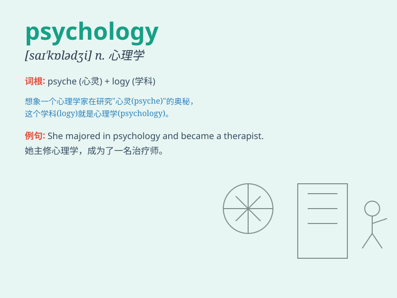

## psychology

**英音:** _[saɪ\'kɒlədʒɪ]_ **美音:** _[saɪ\'kɑlədʒi]_

**译义:** *n.心理学,心理状态*

### 短语

+ **abnormal psychology:** _变态心理学_

+ **applied psychology:** _应用心理学_

+ **child psychology:** _儿童心理学_

+ **cognitive psychology:** _认知心理学_

+ **social psychology:** _社会心理学_

### 例句

#### 例句1

> **I\'m majoring in psychology at university.**

**中文翻译:** 我在大学主修心理学。

**单词释义:** 心理学

#### 例句2

> **The study of psychology helps us understand human behavior.**

**中文翻译:** 心理学研究有助于我们理解人类行为。

**单词释义:** 心理学

#### 例句3

> **She has a deep knowledge of psychology.**

**中文翻译:** 她对心理学有很深的了解。

**单词释义:** 心理学

### 背诵小故事

> A young student was always curious about why people think and act the
way they do. So, he decided to study \'psychology\' to uncover the
secrets of the human mind. With this knowledge, he could understand and
help others better.

**一个年轻的学生总是好奇人们为什么会这样思考和行动。所以，他决定学习"心理学"来揭开人类思维的秘密。有了这些知识，他可以更好地理解和帮助他人。**

### 图义

