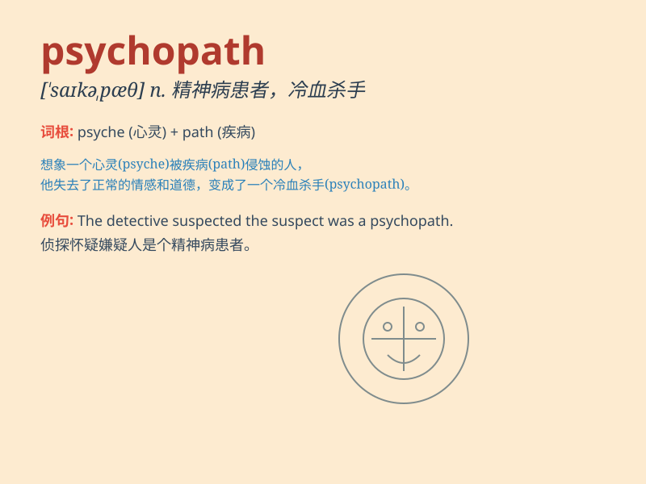

## psychopath

**英音:** _[\'saɪkəpæθ]_ **美音:** _[\'saɪkəpæθ]_

**译义:** *n.精神病患者*

### 短语

+ **serial psychopath:** _连环精神病患者_

+ **clinical psychopath:** _临床精神病患者_

+ **violent psychopath:** _暴力型精神病患者_

+ **diagnosed psychopath:** _被诊断出的精神病患者_

+ **charismatic psychopath:** _有魅力的精神病患者_

### 例句

#### 例句1

> **The serial killer was identified as a psychopath with no remorse
for his actions.**

**中文翻译:** 连环杀手被认定为精神病患者，对自己的行为毫无悔意。

**单词释义:** 精神病患者

#### 例句2

> **She was terrified when she realized she was dealing with a
psychopath.**

**中文翻译:**
当她意识到自己面对的是一个精神病患者时，她感到非常害怕。

**单词释义:** 精神病患者

#### 例句3

> **The movie depicted a chilling story of a psychopath on the
loose.**

**中文翻译:**
这部电影讲述了一个逍遥法外的精神病患者的令人毛骨悚然的故事。

**单词释义:** 精神病患者

### 背诵小故事

> A detective was chasing a criminal. The criminal showed no emotion or
remorse, always calm and cold. The detective realized this was a
psychopath who had no normal feelings.

**一位侦探正在追捕一名罪犯。罪犯没有任何情感或懊悔，总是冷静和冷酷。侦探意识到这是一个没有正常情感的精神病患者。**

### 图义

