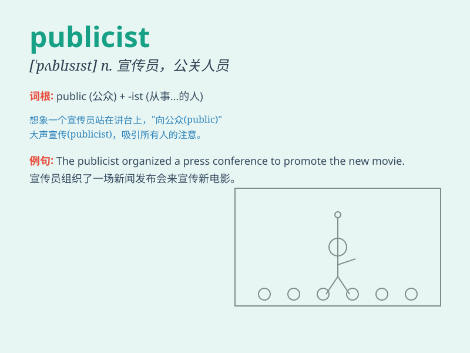

## publicist

**英音:** _[\'pʌblɪsɪst]_ **美音:** _[\'pʌblɪsɪst]_

**译义:** *n.国际法专家,政评作家,广告员*

### 短语

+ **press publicist:** _新闻公关人员_

+ **celebrity publicist:** _名人公关_

+ **corporate publicist:** _企业公关人员_

+ **political publicist:** _政治公关_

+ **music publicist:** _音乐公关_

### 例句

#### 例句1

> **The publicist arranged a press conference for the celebrity.**

**中文翻译:** 公关人员为这位名人安排了一场新闻发布会。

**单词释义:** 公关人员

#### 例句2

> **The publicist worked hard to improve the client\'s public
image.**

**中文翻译:** 公关人员努力提高客户的公众形象。

**单词释义:** 公关人员

#### 例句3

> **She hired a publicist to handle the media attention.**

**中文翻译:** 她聘请了一名公关人员来应对媒体的关注。

**单词释义:** 公关人员

### 背诵小故事

> A publicist was like a messenger for a famous singer. The
publicist\'s job was to tell the public all the good news about the
singer. People came to know the singer better because of the hard work
of the publicist.

**一位宣传人员就像是一位著名歌手的信使。这位宣传人员的工作就是向公众讲述关于这位歌手的所有好消息。因为宣传人员的努力工作，人们更好地了解了这位歌手。**

### 图义

