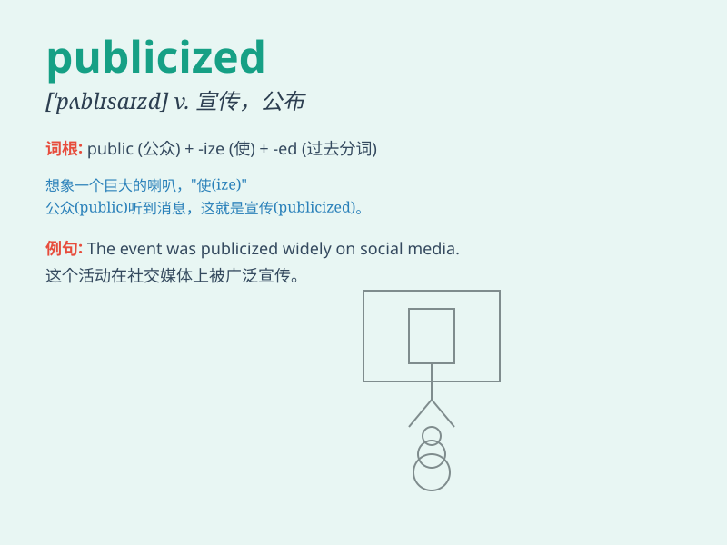

## publicized

**英音:** _[ˈpʌb.lɪ.said]_ **美音:** _[ˈpʌb.lɪ.zaid]_

**译义:** *vt.公布，宣传（publicize的过去式和过去分词形式）*

### 短语

+ **be publicized widely:** _被广泛宣传_

+ **publicized event:** _公开的事件_

+ **publicized information:** _公开的信息_

+ **publicized opinion:** _公开的意见_

+ **publicized statement:** _公开声明_

### 例句

#### 例句1

> **The new policy was widely publicized to ensure public
awareness.**

**中文翻译:** 新政策被广泛宣传以确保公众知晓。

**单词释义:** 宣传

#### 例句2

> **The event was poorly publicized, resulting in low attendance.**

**中文翻译:** 这个活动宣传得不好，导致出席率很低。

**单词释义:** 宣传

#### 例句3

> **The company\'s achievements have been actively publicized in the
media.**

**中文翻译:** 公司的成就一直在媒体上被积极宣传。

**单词释义:** 宣传

### 背诵小故事

> A famous singer\'s new song was publicized widely. Everyone knew
about it. The media spread the news everywhere, making it known to the
public. So, publicized means made known to a lot of people.

**一位著名歌手的新歌被广泛宣传。每个人都知道了。媒体到处传播这个消息，让它被大众知晓。所以，publicized
意思是被广泛传播、被众人知晓。**

### 图义

