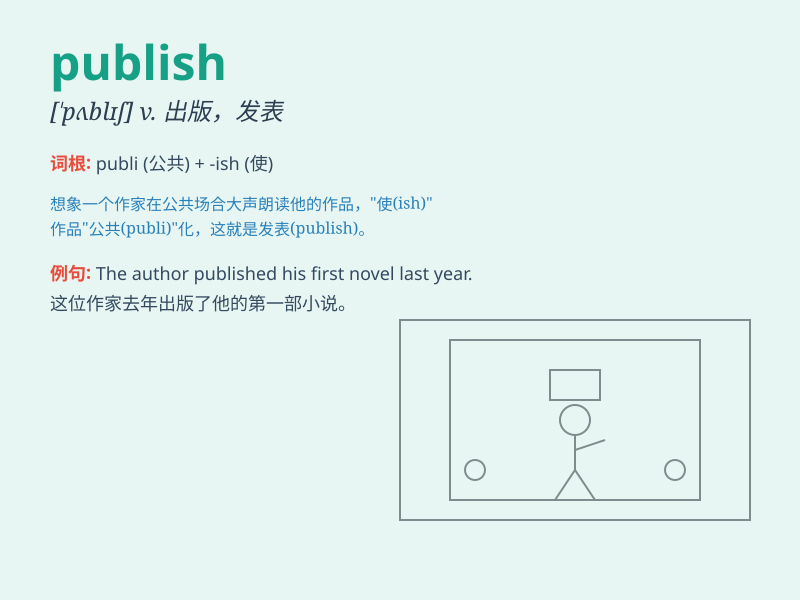

## publish

**英音:** _[\'pʌblɪʃ]_ **美音:** _[\'pʌblɪʃ]_

**译义:** *v.出版,刊印vt.公布,发表*

### 短语

+ **publish a book:** _出版一本书_

+ **publish a magazine:** _出版一本杂志_

+ **publish a newspaper:** _出版一份报纸_

+ **publish research findings:** _发表研究成果_

+ **publish an announcement:** _发布一则公告_

### 例句

#### 例句1

> **The company plans to publish a new book next month.**

**中文翻译:** 该公司计划下个月出版一本新书。

**单词释义:** 出版

#### 例句2

> **She has published several research papers on this topic.**

**中文翻译:** 她发表了多篇关于该主题的研究论文。

**单词释义:** 发表

#### 例句3

> **The newspaper refused to publish the story.**

**中文翻译:** 该报拒绝发表这个故事。

**单词释义:** 刊登

### 背诵小故事

> A young writer was very nervous. But he finally gathered courage to
publish his first book. To his surprise, it became a huge success and
was loved by many readers.

**一位年轻的作家非常紧张。但他最终鼓起勇气出版了他的第一本书。令他惊讶的是，这本书大获成功，受到了许多读者的喜爱。**

### 图义

