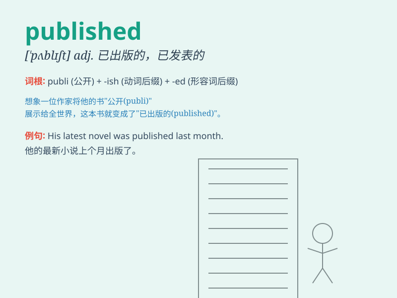

## published

**英音:** _[ˈpʌblɪʃt]_ **美音:** _[ˈpʌblɪʃt]_

**译义:** *adj.已发表的；已出版的；已公布的
v.发表；出版；公布（publish的过去分词）*

### 短语

+ **published author:** _已出版作品的作者_

+ **published data:** _公布的数据_

+ **published report:** _已发表的报告_

+ **published work:** _已出版的作品_

+ **recently published:** _最近出版的_

### 例句

#### 例句1

> **The book was published last year.**

**中文翻译:** 这本书去年出版了。

**单词释义:** 出版

#### 例句2

> **His research results were published in a prestigious journal.**

**中文翻译:** 他的研究成果发表在一份著名的期刊上。

**单词释义:** 发表

#### 例句3

> **The newspaper published an article about the incident.**

**中文翻译:** 这家报纸刊登了一篇关于该事件的文章。

**单词释义:** 刊登

### 背诵小故事

> A young author worked hard for months and finally saw his book
published. It was like a dream come true. His story was shared with the
world, making him very happy.

**一位年轻的作者努力了数月，终于看到他的书出版了。这就像梦想成真。他的故事得以与世界分享，让他非常开心。**

### 图义

