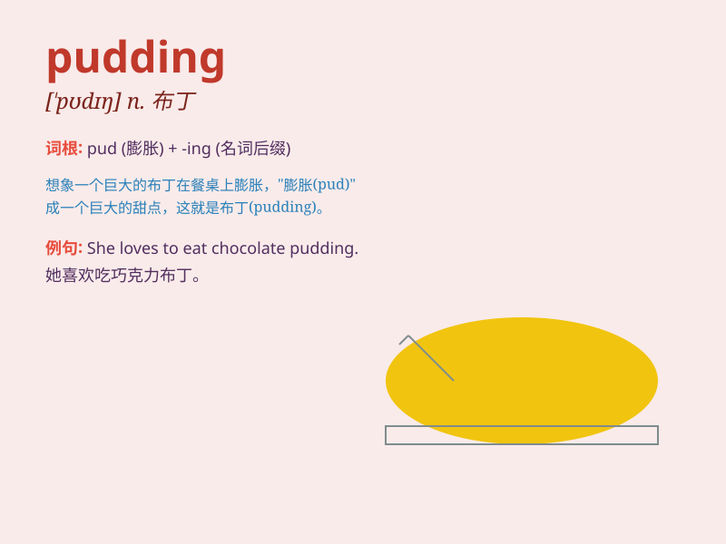

## pudding

**英音:** _[\'pʊdɪŋ]_ **美音:** _[\'pʊdɪŋ]_

**译义:** *n.布丁(一种以面粉,牛奶,鸡蛋等为基料的糊壮甜食)*

### 短语

+ **Christmas pudding:** _圣诞布丁_

+ **rice pudding:** _大米布丁_

+ **bread pudding:** _面包布丁_

+ **pudding face:** _胖圆脸_

+ **pudding basin:** _布丁盆_

### 例句

#### 例句1

> **I love chocolate pudding.**

**中文翻译:** 我喜欢巧克力布丁。

**单词释义:** 布丁

#### 例句2

> **The pudding is too sweet for me.**

**中文翻译:** 这布丁对我来说太甜了。

**单词释义:** 布丁

#### 例句3

> **She made a delicious rice pudding.**

**中文翻译:** 她做了一份美味的大米布丁。

**单词释义:** 布丁

### 背诵小故事

> One day, a little boy was very hungry. His mom made a delicious
pudding for him. The pudding was sweet and soft. The boy ate it happily
and said, \'This pudding is so wonderful!\'

**一天，一个小男孩非常饿。他的妈妈为他做了一份美味的布丁。布丁又甜又软。小男孩开心地吃着并说：'这个布丁太棒了！'**

### 图义

