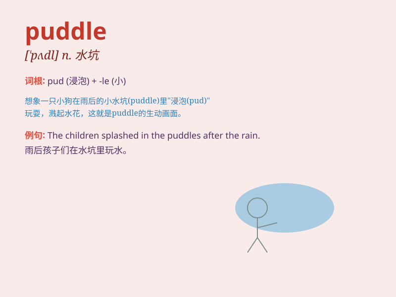

## puddle

**英音:** _[\'pʌd(ə)l]_ **美音:** _[\'pʌdl]_

**译义:** *n.水坑,胶土,污水坑,vt.搅浊,混凝vi.捣成泥浆*

### 短语

+ **muddy puddle:** _泥泞的水坑_

+ **rain puddle:** _雨水坑_

+ **jump in a puddle:** _跳进水坑_

+ **fill a puddle:** _填满水坑_

+ **dry puddle:** _干涸的水坑_

### 例句

#### 例句1

> **The children were jumping in the puddle after the rain.**

**中文翻译:** 雨后孩子们在水坑里跳来跳去。

**单词释义:** 水坑；泥潭

#### 例句2

> **There was a deep puddle on the road, and cars had to drive around
it.**

**中文翻译:** 路上有一个很深的水坑，汽车不得不绕着它开。

**单词释义:** 水坑

#### 例句3

> **The dog splashed through the puddle and got its paws wet.**

**中文翻译:** 狗溅着水穿过水坑，爪子弄湿了。

**单词释义:** 水坑

### 背诵小故事

> One rainy day, a little rabbit hopped along and saw a big puddle on
the road. It was so wide that it looked like a small lake. The rabbit
had to find a way around the puddle to keep its paws dry.

**在一个雨天，一只小兔子蹦蹦跳跳，在路上看到一个大水坑。它宽得像一个小湖。兔子不得不找路绕过这个水坑，以保持它的爪子干爽。**

### 图义

