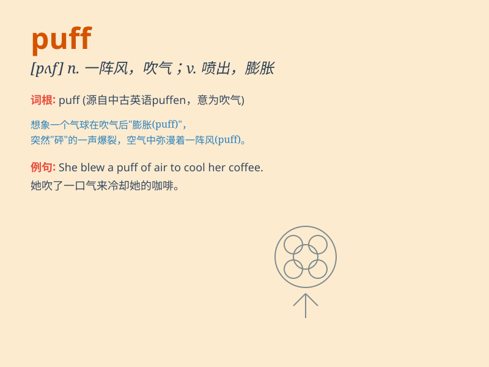

## puff

**英音:** _[pʌf]_ **美音:** _[pʌf]_

**译义:**
*n.一阵喷烟,肿块,蓬松,吹嘘,宣传广告v.喷出,张开,夸张,(使)膨胀,(使)骄傲,喘息,鼓吹,吹捧*

### 短语

+ **puff out:** _膨胀；鼓起_

+ **puff up:** _使肿胀；使膨胀_

+ **puff away:** _不停地吸（烟等）_

+ **puff of wind:** _一阵风_

+ **puff pastry:** _千层酥；油酥面皮_

### 例句

#### 例句1

> **The wind made the candles puff out.**

**中文翻译:** 风把蜡烛吹灭了。

**单词释义:** 吹灭

#### 例句2

> **She took a puff on her cigarette.**

**中文翻译:** 她吸了一口香烟。

**单词释义:** 吸，抽（一口）

#### 例句3

> **The train came puffing into the station.**

**中文翻译:** 火车喷着烟驶进了车站。

**单词释义:** 喷着烟移动

### 背诵小故事

> A little mouse was running in the field. Suddenly, it saw a big puff
of smoke. It was so scared and ran away quickly. The puff looked like a
monster.

**一只小老鼠正在田野里跑。突然，它看到一大团烟雾。它非常害怕，迅速跑开了。这团烟雾看起来像个怪物。**

### 图义

