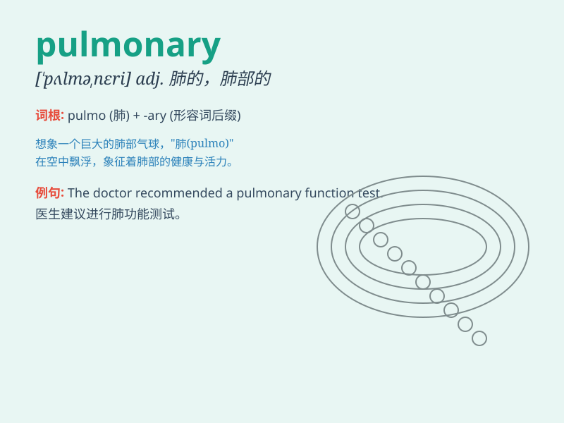

## pulmonary

**英音:** _[\'pʌlmən(ə)rɪ]_ **美音:** _[\'pʌlmənɛri]_

**译义:** *adj.肺部的*

### 短语

+ **pulmonary artery:** _肺动脉_

+ **pulmonary vein:** _肺静脉_

+ **pulmonary tuberculosis:** _肺结核_

+ **pulmonary edema:** _肺水肿_

+ **pulmonary function:** _肺功能_

### 例句

#### 例句1

> **The doctor diagnosed him with pulmonary tuberculosis.**

**中文翻译:** 医生诊断他患有肺结核。

**单词释义:** 肺的

#### 例句2

> **Pulmonary function tests are often used to assess lung
health.**

**中文翻译:** 肺功能测试常用于评估肺部健康状况。

**单词释义:** 肺的

#### 例句3

> **She has a chronic pulmonary disease that requires regular
treatment.**

**中文翻译:** 她患有慢性肺病，需要定期治疗。

**单词释义:** 肺的

### 背诵小故事

>
想象一下，有个叫普利的小勇士，他的任务是守护肺部的健康。他总是在肺部的世界里巡逻，确保'pulmonary'（肺部的）功能正常。普利的努力让我们记住了pulmonary这个单词。

**想象有个叫普利的小勇士守护肺部健康，从而记住pulmonary（肺部的）这个单词。**

### 图义

