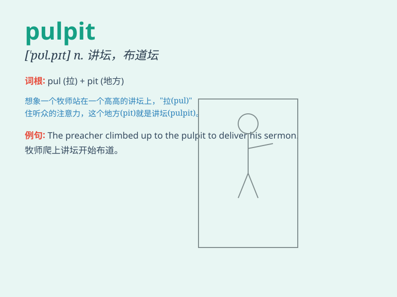

## pulpit

**英音:** _[\'pʊlpɪt]_ **美音:** _[\'pʊlpɪt]_

**译义:** *n.(教堂的)讲道坛*

### 短语

+ **pulpit ministry:** _讲道事工_

+ **pulpit orator:** _讲坛演说家_

+ **step into the pulpit:** _登上讲坛_

+ **pulpit preaching:** _讲坛布道_

+ **leave the pulpit:** _离开讲坛_

### 例句

#### 例句1

> **The priest stood at the pulpit and delivered a passionate
sermon.**

**中文翻译:** 牧师站在讲道坛上发表了一篇充满激情的布道。

**单词释义:** 讲道坛

#### 例句2

> **He climbed up to the pulpit to address the audience.**

**中文翻译:** 他爬上讲道坛向观众讲话。

**单词释义:** 讲道坛

#### 例句3

> **The speaker commanded the attention of the crowd from the
pulpit.**

**中文翻译:** 演讲者在讲道坛上吸引了人群的注意力。

**单词释义:** 讲道坛

### 背诵小故事

> A young priest was very nervous when he first stood in the pulpit to
give a sermon. But as he spoke, he gained confidence and delivered a
wonderful message. The pulpit became a place of inspiration for him.

**一位年轻的牧师第一次站在讲道坛上讲道时非常紧张。但当他开口时，他获得了信心，并传递了精彩的信息。讲道坛成为了他鼓舞人心的地方。**

### 图义

