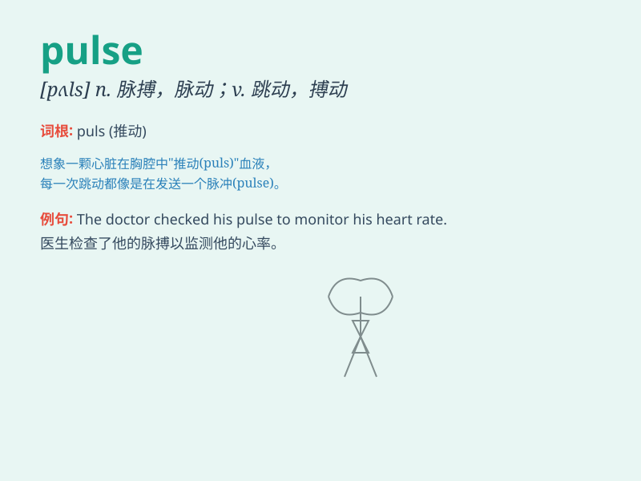

## pulse

**英音:** _[pʌls]_ **美音:** _[pʌls]_

**译义:** *n.脉搏,脉冲*

### 短语

+ **pulse rate:** _脉搏率_

+ **weak pulse:** _微弱的脉搏_

+ **rapid pulse:** _快速的脉搏_

+ **irregular pulse:** _不规则的脉搏_

+ **feel the pulse:** _摸脉；试探（舆论等）_

### 例句

#### 例句1

> **The doctor checked my pulse.**

**中文翻译:** 医生检查了我的脉搏。

**单词释义:** 脉搏

#### 例句2

> **The music has a strong pulse that makes you want to dance.**

**中文翻译:** 这首音乐有强烈的节奏，让你想要跳舞。

**单词释义:** 节奏

#### 例句3

> **The news sent a pulse of excitement through the town.**

**中文翻译:** 这个消息在镇上引起了一阵兴奋的波动。

**单词释义:** 波动；脉冲

### 背诵小故事

>
有一天，小明参加了一场马拉松比赛。跑了很久后，他感到心跳急速，仿佛能听到自己的脉搏（pulse）跳动声。这让他意识到自己的体力快到极限了。最终，他凭借毅力坚持到了终点。

**有一天，小明参加马拉松比赛，跑很久后能听到自己急速的脉搏跳动声，意识到体力快到极限，最终凭借毅力到终点。**

### 图义

