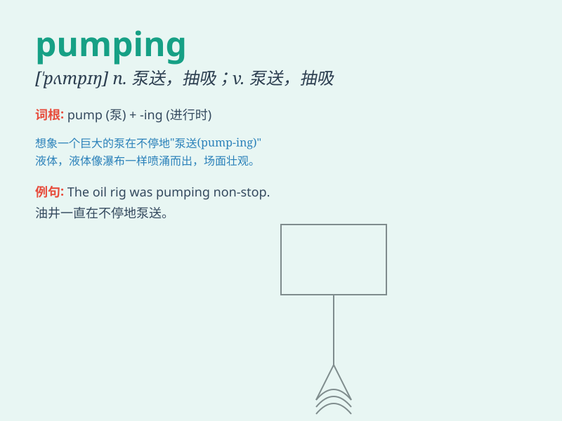

## pumping

**英音:** _[ˈpʌmpɪŋ]_ **美音:** _[ˈpʌmpɪŋ]_

**译义:** *n.泵送；抽吸；抽运
v.用泵输送；涌出；注入；快速上下（或内外）运动；剧烈运动（pump
的现在分词）*

### 短语

+ **pumping station:** _抽水站；泵站_

+ **pumping system:** _泵送系统；抽水系统_

+ **pumping capacity:** _泵送能力；抽水能力_

+ **pumping action:** _泵送作用；抽水作用_

+ **pumping equipment:** _泵送设备；抽水设备_

### 例句

#### 例句1

> **The heart is pumping blood throughout the body.**

**中文翻译:** 心脏正在向全身泵血。

**单词释义:** （用泵）输送，泵送

#### 例句2

> **She was pumping iron at the gym.**

**中文翻译:** 她正在健身房举重。

**单词释义:** 做（健身运动中的）推举动作

#### 例句3

> **The music was pumping and everyone was dancing.**

**中文翻译:** 音乐很劲爆，每个人都在跳舞。

**单词释义:** （使）强烈地跳动，律动

### 背诵小故事

> A man was pumping water from a well. He was sweating but kept pumping
hard because the water was needed for his thirsty plants. Finally, the
bucket was full. The act of pumping water was tiring but rewarding.

**一个男人正在从井里抽水。他汗流浃背，但仍努力抽水，因为他干渴的植物需要水。最后，水桶满了。抽水的行为很累但很值得。**

### 图义

