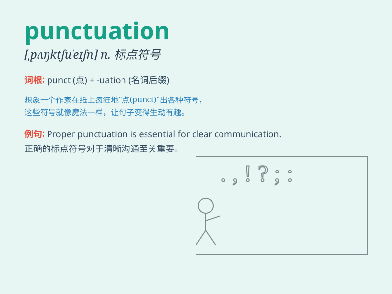

## punctuation

**英音:** _[pʌŋ(k)tʃʊ\'eɪʃ(ə)n; -tjʊ-]_ **美音:**
_[\'pʌŋktʃʊ\'eʃən]_

**译义:** *n.标点,标点符号*

### 短语

+ **punctuation mark:** _标点符号_

+ **correct punctuation:** _正确的标点_

+ **poor punctuation:** _糟糕的标点_

+ **learn punctuation:** _学习标点_

+ **master punctuation:** _精通标点_

### 例句

#### 例句1

> **The punctuation in this essay is incorrect.**

**中文翻译:** 这篇文章中的标点符号不正确。

**单词释义:** 标点符号

#### 例句2

> **She pays great attention to punctuation when writing.**

**中文翻译:** 她写作时非常注意标点。

**单词释义:** 标点

#### 例句3

> **Correct punctuation makes the text more understandable.**

**中文翻译:** 正确的标点使文本更易于理解。

**单词释义:** 标点

### 背诵小故事

> One day, a little monkey was writing a story. But it made many
mistakes in punctuation. A wise owl came and taught it how to use
commas, periods, and question marks correctly. The monkey\'s story
became perfect with good punctuation.

**有一天，一只小猴子在写故事。但它在标点使用上犯了很多错误。一只聪明的猫头鹰过来教它如何正确使用逗号、句号和问号。有了好的标点，猴子的故事变得完美了。**

### 图义

