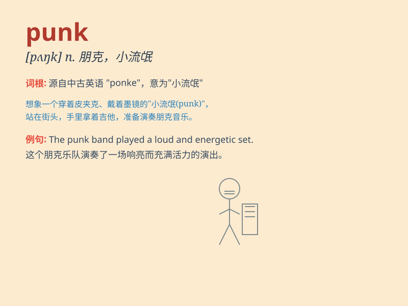

## punk

**英音:** _[pʌŋk]_ **美音:** _[pʌŋk]_

**译义:** *n.废物,小阿飞,年轻无知得人adj.无用的,低劣的 朋客,崩客*

### 短语

+ **punk rock:** _朋克摇滚_

+ **punk hairstyle:** _朋克发型_

+ **punk culture:** _朋克文化_

+ **punk outfit:** _朋克服装_

+ **punk attitude:** _朋克态度_

### 例句

#### 例句1

> **The punk band played a wild and energetic show.**

**中文翻译:** 这支朋克乐队进行了一场狂野且充满活力的演出。

**单词释义:** 朋克（指一种音乐风格或相关的人或事物）

#### 例句2

> **He has a punk hairstyle with colorful spikes.**

**中文翻译:** 他留着一个带有彩色尖刺的朋克发型。

**单词释义:** 朋克风格的

#### 例句3

> **That punk stole my wallet!**

**中文翻译:** 那个小混混偷了我的钱包！

**单词释义:** 小混混，不良少年

### 背诵小故事

> A young man was always dressed strangely and had a wild hairstyle.
People called him punk. He loved rock music and expressed his rebellion
through his unique style. Later, \'punk\' became a word to describe such
a rebellious and unconventional person.

**一个年轻人总是穿着怪异，发型狂野。人们称他为朋克。他热爱摇滚乐，并通过独特的风格表达自己的反叛。后来，\'punk\'这个词就用来形容这种反叛和非传统的人。**

### 图义

