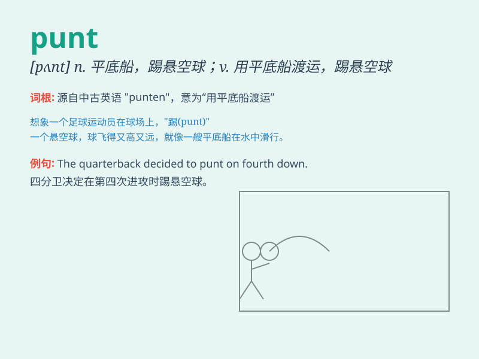

## punt

**英音:** _[pʌnt]_ **美音:** _[pʌnt]_

**译义:**
*n.平底船,撑船,[足][橄]踢悬空球(球未落地前踢出)v.踢凌空球*

### 短语

+ **punt a ball:** _踢球_

+ **punt a boat:** _撑方头平底船_

+ **punt on something:** _在某事上下赌注_

+ **long punt:** _长距离踢球_

+ **accurate punt:** _准确的踢球_

### 例句

#### 例句1

> **The football player decided to punt the ball on the fourth
down.**

**中文翻译:** 这名橄榄球运动员决定在第四次进攻时把球踢出去。

**单词释义:** 踢（悬空球）

#### 例句2

> **We went punting on the river.**

**中文翻译:** 我们去河上撑方头平底船。

**单词释义:** 用篙撑（方头平底船）

#### 例句3

> **He decided to punt on the investment opportunity.**

**中文翻译:** 他决定放弃这次投资机会。

**单词释义:** 放弃；抛弃

### 背诵小故事

> A football player was in a crucial game. The team needed to score,
but the situation was tough. So, he decided to punt the ball to gain
some field position. It was a risky move, but it might change the game.

**一名足球运动员在一场关键比赛中。球队需要得分，但形势艰难。于是，他决定把球踢出去以获得一些场地优势。这是一个冒险的举动，但可能会改变比赛。**

### 图义

