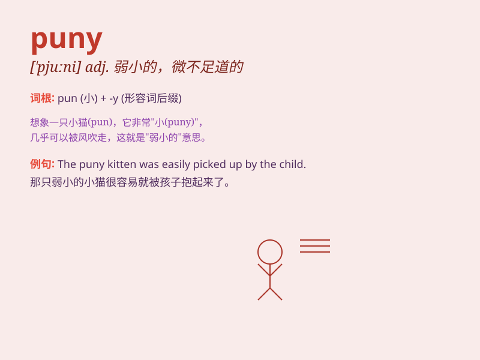

## puny

**英音:** _[\'pjuːnɪ]_ **美音:** _[\'pjuni]_

**译义:** *adj.小的,弱的,微不足道的*

### 短语

+ **puny effort:** _微小的努力_

+ **puny frame:** _瘦小的身躯_

+ **puny muscles:** _弱小的肌肉_

+ **puny size:** _极小的尺寸_

+ **puny strength:** _微弱的力量_

### 例句

#### 例句1

> **The puny puppy struggled to keep up with the others.**

**中文翻译:** 这只弱小的小狗努力跟上其他的狗。

**单词释义:** 弱小的

#### 例句2

> **He has a puny build and is often bullied.**

**中文翻译:** 他身材瘦小，经常被欺负。

**单词释义:** 瘦小的

#### 例句3

> **The puny tree was no match for the strong wind.**

**中文翻译:** 这棵弱小的树无法抵御强风。

**单词释义:** 弱小的

### 背诵小故事

> A little boy was always bullied for being puny. But he didn\'t give
up. He trained hard and became strong. Remember, puny means weak and
small.

**一个小男孩总是因为弱小而被欺负。但他没有放弃。他努力训练，变得强壮了。记住，puny
意思是弱小的。**

### 图义

