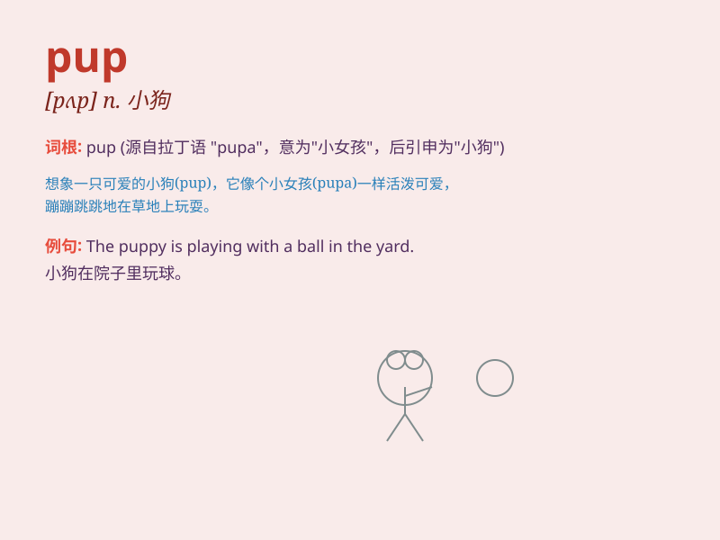

## pup

**英音:** _[pʌp]_ **美音:** _[pʌp]_

**译义:** *n.小狗,幼畜,自负的傻小子v.生小狗*

### 短语

+ **pup tent:** _小帐篷_

+ **sea pup:** _海豹幼崽_

+ **pup joint:** _短节；（钻杆的）短接头_

+ **pup fish:** _幼鱼_

+ **pup stage:** _幼年期_

### 例句

#### 例句1

> **The pup was playing in the garden.**

**中文翻译:** 这只小狗正在花园里玩耍。

**单词释义:** 小狗

#### 例句2

> **She adopted a cute pup from the shelter.**

**中文翻译:** 她从收容所领养了一只可爱的小狗。

**单词释义:** 小狗

#### 例句3

> **The mother dog was looking after her pups.**

**中文翻译:** 狗妈妈正在照顾她的小狗们。

**单词释义:** 小狗（复数）

### 背诵小故事

> One day, a little boy saw a cute dog. He asked his mom, \'What\'s
this?\' His mom said, \'It\'s a pup.\' The little boy remembered that a
pup is a young dog.

**有一天，一个小男孩看到一只可爱的狗。他问妈妈："这是什么？"他妈妈说："这是一只小狗崽。"小男孩记住了
pup 就是年幼的狗。**

### 图义

