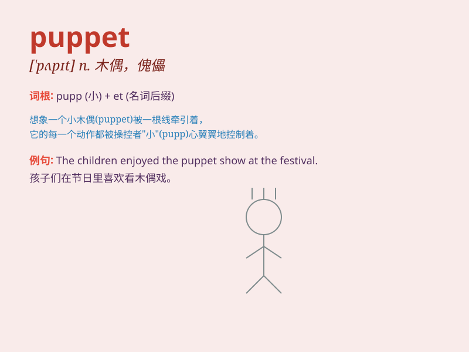

## puppet

**英音:** _[\'pʌpɪt]_ **美音:** _[\'pʌpɪt]_

**译义:** *n.傀儡,木偶*

### 短语

+ **puppet show:** _木偶戏_

+ **puppet government:** _傀儡政府_

+ **hand puppet:** _手偶_

+ **string puppet:** _提线木偶_

+ **puppet master:** _木偶操纵者_

### 例句

#### 例句1

> **The puppet show was very entertaining for the children.**

**中文翻译:** 木偶戏对孩子们来说非常有趣。

**单词释义:** 木偶

#### 例句2

> **He felt like a puppet being controlled by others.**

**中文翻译:** 他觉得自己像个被别人控制的木偶。

**单词释义:** 傀儡；木偶般受他人操纵的人

#### 例句3

> **The politician was accused of being a puppet of the wealthy
interests.**

**中文翻译:** 这位政客被指责是富有利益集团的傀儡。

**单词释义:** 傀儡

### 背诵小故事

> A little girl found a puppet in an old attic. The puppet had big eyes
and a funny smile. It seemed to come alive when the girl played with it.
The puppet became her special friend.

**一个小女孩在一个旧阁楼里发现了一个木偶。这个木偶有大大的眼睛和有趣的笑容。当女孩和它玩耍时，它似乎活了过来。这个木偶成了她特别的朋友。**

### 图义

