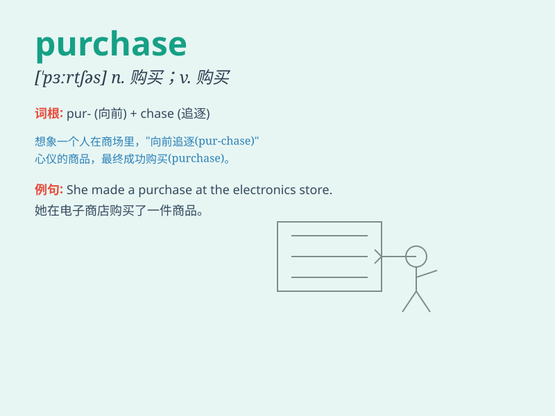

## purchase

**英音:** _[\'pɜ:tʃəs]_ **美音:** _[\'pɝtʃəs]_

**译义:** *vt.买,购买n.买,购买*

### 短语

+ **purchase order:** _购货订单；采购订单_

+ **purchase price:** _买价；采购价格_

+ **make a purchase:** _购买；采购_

+ **purchase contract:** _购货合同；采购合同_

+ **purchase goods:** _购买商品；采购货物_

### 例句

#### 例句1

> **She made a purchase of a new dress.**

**中文翻译:** 她买了一件新裙子。

**单词释义:** 购买

#### 例句2

> **The company\'s recent purchase of new equipment will improve
productivity.**

**中文翻译:** 公司最近购置新设备将提高生产力。

**单词释义:** 购置

#### 例句3

> **His purchase of the painting was a wise investment.**

**中文翻译:** 他购买这幅画是一项明智的投资。

**单词释义:** 购买

### 背诵小故事

> A poor student wanted to purchase a precious book. He saved money for
a long time. Finally, he got enough and made the purchase happily. The
book became his treasure.

**一个贫困的学生想买一本珍贵的书。他攒了很长时间的钱。最终，他攒够了并开心地完成了购买。这本书成了他的宝贝。**

### 图义

