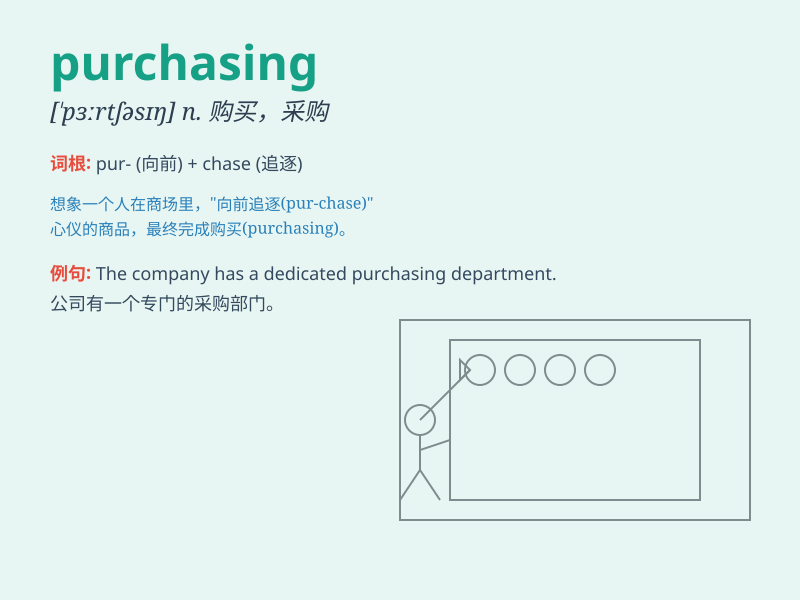

## purchasing

**英音:** _[ˈpɜːtʃəsɪŋ]_ **美音:** _[ˈpɜːrtʃəsɪŋ]_

**译义:** *n. 采购；购买行为；采购部 vi.
购买（purchase的ing形式）*

### 短语

+ **purchasing power:** _购买力_

+ **purchasing department:** _采购部门_

+ **purchasing agent:** _采购代理_

+ **purchasing cost:** _采购成本_

+ **purchasing manager:** _采购经理_

### 例句

#### 例句1

> **The company is focused on improving its purchasing process.**

**中文翻译:** 这家公司正专注于改进其采购流程。

**单词释义:** 采购

#### 例句2

> **Purchasing a new car requires careful consideration.**

**中文翻译:** 购买一辆新车需要仔细考虑。

**单词释义:** 购买

#### 例句3

> **She is in charge of the purchasing department.**

**中文翻译:** 她负责采购部门。

**单词释义:** 采购

### 背诵小故事

> One day, Tom was in a big store. He saw many nice things and decided
to do purchasing. He carefully chose what he needed and paid happily.
Purchasing made him feel fulfilled.

**一天，汤姆在一家大商店里。他看到很多漂亮的东西，决定进行采购。他仔细挑选了自己需要的东西，然后开心地付了钱。采购让他感到满足。**

### 图义

