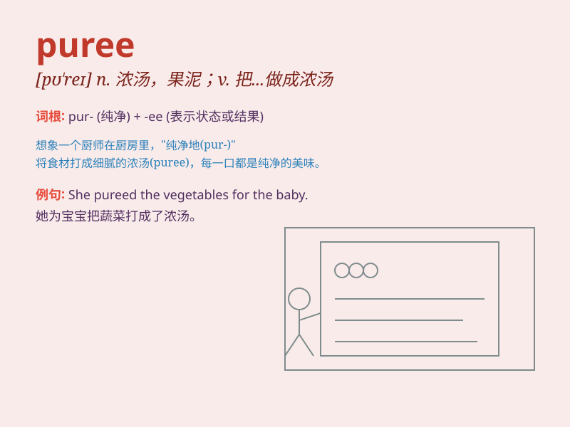

## puree

**英音:** _[\'puːrɪ]_ **美音:** _[ˈpjʊəreɪ]_

**译义:** *n.菜肴的一种,浓汤v.(将菜,水果等)煮成浓汤,面包的一种*

### 短语

+ **apple puree:** _苹果泥_

+ **tomato puree:** _番茄泥_

+ **vegetable puree:** _蔬菜泥_

+ **fruit puree:** _水果泥_

+ **potato puree:** _土豆泥_

### 例句

#### 例句1

> **I pureed the strawberries to make a smoothie.**

**中文翻译:** 我把草莓打成了果泥来制作奶昔。

**单词释义:** 把\...\...打成泥

#### 例句2

> **The chef pureed the vegetables for the soup.**

**中文翻译:** 厨师把蔬菜打成泥来做汤。

**单词释义:** 把\...\...打成泥

#### 例句3

> **She pureed the apples to make baby food.**

**中文翻译:** 她把苹果打成泥来制作婴儿食品。

**单词释义:** 把\...\...打成泥

### 背诵小故事

> Once upon a time, a chef was making a special dish. He took fresh
fruits and mashed them into a smooth and fine substance. This mashed
form was called \'puree\', which was pure and delicious.

**从前，有个厨师在做一道特别的菜。他取了新鲜水果，把它们捣成了细腻光滑的物质。这种捣成的形态就被叫做'puree'，纯粹又美味。**

### 图义

