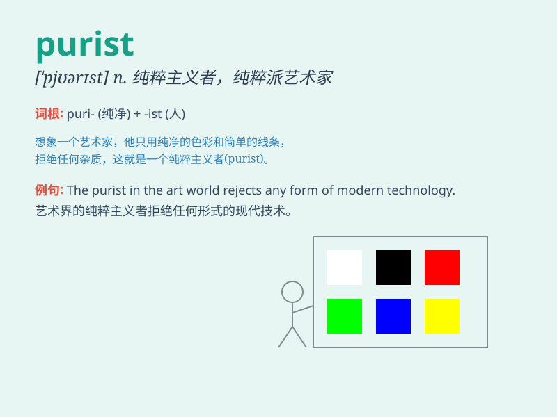

## purist

**英音:** _[\'pjʊərɪst]_ **美音:** _[\'pjʊrɪst]_

**译义:** *n.纯化论者*

### 短语

+ **purist approach:** _纯粹主义的方法_

+ **language purist:** _语言纯粹主义者_

+ **art purist:** _艺术纯粹主义者_

+ **purist view:** _纯粹主义的观点_

+ **purist stance:** _纯粹主义的立场_

### 例句

#### 例句1

> **The purist insists on using only traditional methods in
cooking.**

**中文翻译:** 这位纯粹主义者坚持在烹饪中只使用传统方法。

**单词释义:** 纯粹主义者

#### 例句2

> **She\'s a purist when it comes to art and won\'t accept any modern
interpretations.**

**中文翻译:**
当涉及到艺术时，她是个纯粹主义者，不接受任何现代的诠释。

**单词释义:** 纯粹主义者

#### 例句3

> **The language purist was critical of the new words entering the
dictionary.**

**中文翻译:** 这位语言纯粹主义者对新进入词典的单词持批评态度。

**单词释义:** 纯粹主义者

### 背诵小故事

> A purist artist refused to use any modern tools. He insisted on
traditional methods, believing they were the only pure way to create.
But his stubbornness made him struggle to finish his works.

**一位纯粹主义艺术家拒绝使用任何现代工具。他坚持使用传统方法，认为这是创作的唯一纯粹方式。但他的固执让他在完成作品时举步维艰。**

### 图义

