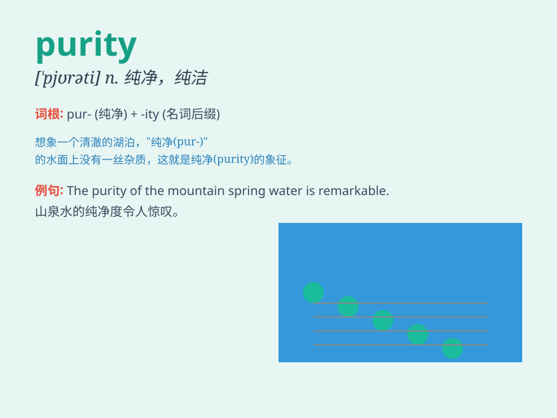

## purity

**英音:** _[\'pjʊərɪtɪ]_ **美音:** _[\'pjʊrəti]_

**译义:** *n.纯净,纯洁,纯度*

### 短语

+ **purity of heart:** _心灵的纯洁_

+ **purity test:** _纯度测试_

+ **chemical purity:** _化学纯度_

+ **purity standard:** _纯度标准_

+ **purity level:** _纯度级别_

### 例句

#### 例句1

> **The purity of the water in this lake is remarkable.**

**中文翻译:** 这个湖中的水的纯净度非常出色。

**单词释义:** 纯净；纯洁；纯度

#### 例句2

> **She was admired for the purity of her soul.**

**中文翻译:** 她因其灵魂的纯洁而受到钦佩。

**单词释义:** 纯洁；纯净

#### 例句3

> **Tests are conducted to determine the purity of gold.**

**中文翻译:** 进行测试以确定黄金的纯度。

**单词释义:** 纯度

### 背诵小故事

> A fairy was guarding the purity of a magic spring. Anyone who drank
from it became pure-hearted. One day, a villain tried to pollute it, but
the fairy protected it and maintained its purity.

**一位仙女守护着一个神奇泉水的纯净。任何喝了泉水的人都会变得心灵纯净。有一天，一个恶棍试图污染它，但仙女保护了它，保持了其纯净。**

### 图义

