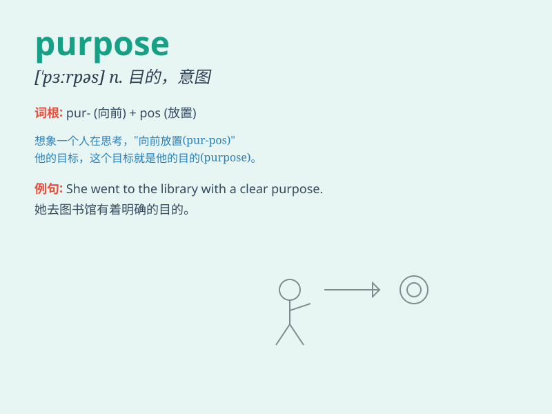

## purpose

**英音:** _[\'pɜːpəs]_ **美音:** _[\'pɝpəs]_

**译义:** *n.目的,意图,用途,效果,决心,意志vt.打算,企图,决心*

### 短语

+ **on purpose:** _故意；有意地_

+ **for the purpose of:** _为了；出于\...\...的目的_

+ **with the purpose of:** _带有\...\...的目的_

+ **serve the purpose:** _管用；能解决问题_

+ **general purpose:** _通用；一般用途_

### 例句

#### 例句1

> **The purpose of this meeting is to discuss the new project.**

**中文翻译:** 这次会议的目的是讨论新项目。

**单词释义:** 目的

#### 例句2

> **She seems to have no clear purpose in life.**

**中文翻译:** 她似乎生活没有明确的目标。

**单词释义:** 目标

#### 例句3

> **What is the purpose of your visit?**

**中文翻译:** 你来访的目的是什么？

**单词释义:** 目的

### 背诵小故事

> A young artist was confused about his future. One day, he met an old
master. The master asked him, \'What is your purpose in art?\' The
artist thought hard and finally found his clear purpose - to express
beauty and emotions through his paintings.

**一位年轻的艺术家对自己的未来感到迷茫。有一天，他遇到了一位老大师。大师问他：'你在艺术方面的目的是什么？'艺术家努力思考，最终找到了他明确的目的------通过他的画作表达美和情感。**

### 图义

