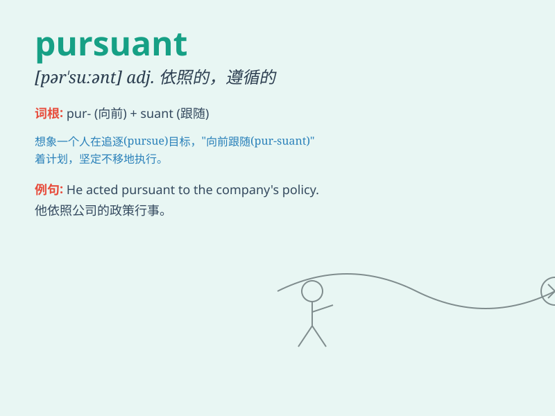

## pursuant

**英音:** _[pə\'sjuːənt]_ **美音:** _[pɚ\'suənt]_

**译义:** *adj.追踪的,依照的*

### 短语

+ **pursuant to:** _依照；按照；根据_

+ **pursuant of:** _追求；寻求_

+ **be pursuant:** _是依照的；是按照的_

+ **act pursuant:** _依照行动；按照行事_

+ **proceed pursuant:** _依照进行；按照开展_

### 例句

#### 例句1

> **The company acted pursuant to the new regulations.**

**中文翻译:** 这家公司依照新规定行事。

**单词释义:** 依照；按照

#### 例句2

> **He was arrested pursuant to a warrant.**

**中文翻译:** 他根据逮捕证被捕。

**单词释义:** 根据；依据

#### 例句3

> **The decision was made pursuant to the advice of the experts.**

**中文翻译:** 这个决定是依据专家的建议做出的。

**单词释义:** 依据；按照

### 背诵小故事

> A detective was on a case pursuant to a mysterious clue. He followed
it diligently, never giving up, until he solved the mystery.
\'Pursuant\' here means following or in accordance with.

**一位侦探根据一个神秘的线索办案。他坚持不懈地追踪，直到解开谜团。'pursuant'在这里指的是依照，根据。**

### 图义

