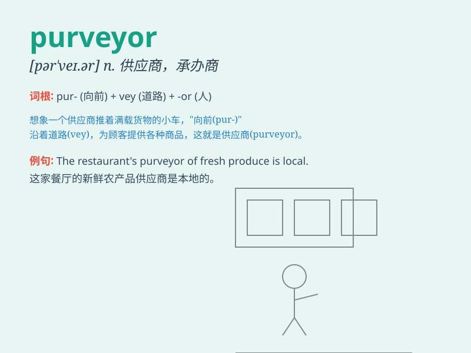

## purveyor

**英音:** _[pəˈveɪə(r)]_ **美音:** _[pərˈveɪər]_

**译义:** *n.承办商,伙食承办商*

### 短语

+ **purveyor of goods:** _货物供应商_

+ **purveyor of services:** _服务提供者_

+ **leading purveyor:** _主要供应商_

+ **reliable purveyor:** _可靠的供应商_

+ **local purveyor:** _当地供应商_

### 例句

#### 例句1

> **The purveyor of fine wines was highly regarded in the
industry.**

**中文翻译:** 优质葡萄酒的供应商在业内备受推崇。

**单词释义:** 供应商；提供者

#### 例句2

> **The local purveyor of fresh produce supplies many
restaurants.**

**中文翻译:** 当地的新鲜农产品供应商为许多餐馆供货。

**单词释义:** 供应商；提供者

#### 例句3

> **He is known as a purveyor of rare books.**

**中文翻译:** 他以稀有书籍的供应商而闻名。

**单词释义:** 供应商；提供者

### 背诵小故事

> A king was always worried about the quality of food. Then came a
purveyor who promised to supply the best. He traveled far and wide,
carefully selected ingredients, and finally won the king\'s trust.

**一位国王总是担心食物的质量。后来来了一位供应商，他承诺提供最好的食物。他四处奔波，精心挑选食材，最终赢得了国王的信任。**

### 图义

