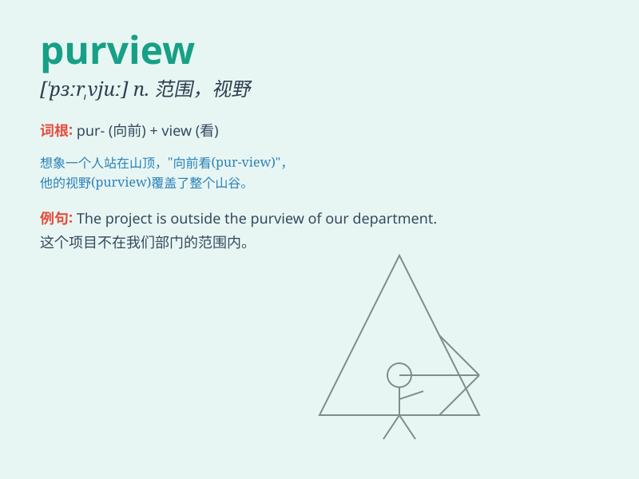

## purview

**英音:** _[\'pɜːvjuː]_ **美音:** _[\'pɝvju]_

**译义:** *n.范围*

### 短语

+ **within purview:** _在范围之内_

+ **beyond purview:** _超出范围_

+ **purview of authority:** _权力范围_

+ **purview of law:** _法律范围_

+ **purview of discussion:** _讨论范围_

### 例句

#### 例句1

> **The purview of this law is clearly defined.**

**中文翻译:** 这部法律的范围被清晰地界定了。

**单词释义:** 范围；权限

#### 例句2

> **His job falls outside the purview of my department.**

**中文翻译:** 他的工作不在我部门的权限之内。

**单词释义:** 权限；职责范围

#### 例句3

> **The issue is beyond the purview of this committee.**

**中文翻译:** 这个问题超出了这个委员会的职责范围。

**单词释义:** 职责范围；权限

### 背诵小故事

> A detective was on a case. The purview of his investigation was
within the boundaries of a mysterious mansion. But as he explored, he
found the purview expanded to include a hidden underground chamber.

**一位侦探在办案。他的调查范围在一座神秘的宅邸内。但随着他的探索，他发现范围扩大到包括一个隐藏的地下室。**

### 图义

