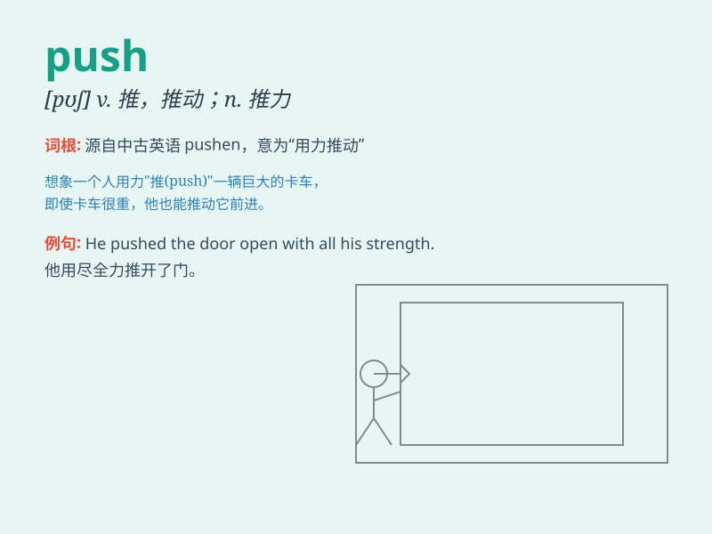

## push

**英音:** _[pʊʃ]_ **美音:** _[pʊʃ]_

**译义:**
*n.推,推动,奋发,干劲,进取心,攻击vt.推,推动,推行,逼迫,增加vi.推,推进,增加,努力争取*

### 短语

+ **push ahead:** _毅然前行；推进_

+ **push for:** _努力争取；竭力推动_

+ **push through:** _使通过；促成_

+ **push up:** _推上去；提高_

+ **push back:** _推回；使后退；抵制_

### 例句

#### 例句1

> **He pushed the door open.**

**中文翻译:** 他把门推开了。

**单词释义:** 推

#### 例句2

> **She pushed her way through the crowd.**

**中文翻译:** 她从人群中挤过去了。

**单词释义:** 挤；推挤

#### 例句3

> **Don\'t push me! I\'m very angry.**

**中文翻译:** 别逼我！我非常生气。

**单词释义:** 逼迫

### 背诵小故事

> A little boy was trying to move a big box. He used all his strength
to push it but it was very hard. Finally, with one last big push, he
succeeded!

**一个小男孩试图移动一个大箱子。他用尽全身力气去推它，但这非常困难。最后，再一次大力推之后，他成功了！**

### 图义

