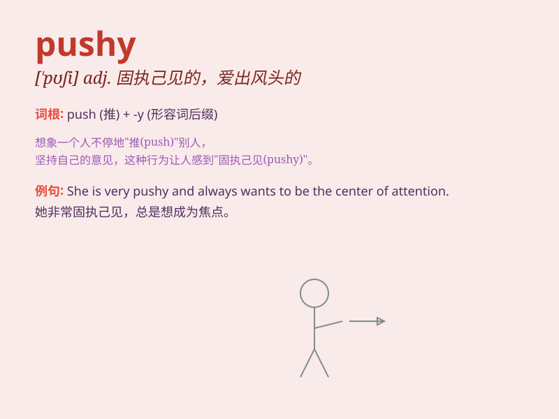

## pushy

**英音:** _[\'pʊʃɪ]_ **美音:** _[\'pʊʃi]_

**译义:** *adj.有进取心的*

### 短语

+ **pushy salesperson:** _强行推销的销售员_

+ **be pushy about:** _在\...\...方面很强势_

+ **pushy behavior:** _爱出风头的行为_

+ **too pushy:** _太固执己见；太咄咄逼人_

+ **a pushy parent:** _一个望子成龙的家长_

### 例句

#### 例句1

> **She\'s so pushy that no one wants to work with her.**

**中文翻译:** 她太爱出风头了，以至于没人愿意和她一起工作。

**单词释义:** 爱出风头的；执意强求的

#### 例句2

> **The pushy salesman wouldn\'t take no for an answer.**

**中文翻译:** 那个固执的推销员不接受拒绝。

**单词释义:** 固执的；一意孤行的

#### 例句3

> **Don\'t be so pushy when asking for a raise.**

**中文翻译:** 要求加薪时别这么急切。

**单词释义:** 急切的；强求的

### 背诵小故事

> One day, I met a salesperson who was very pushy. He kept insisting
that I buy his product without even listening to my needs. It made me
feel very uncomfortable. Later, I learned that \'pushy\' means being too
forceful or aggressive.

**有一天，我遇到了一个销售人员，他非常强硬。他一直坚持让我买他的产品，甚至不听我的需求。这让我感到非常不舒服。后来，我知道了"pushy"意思是过于强硬或咄咄逼人。**

### 图义

