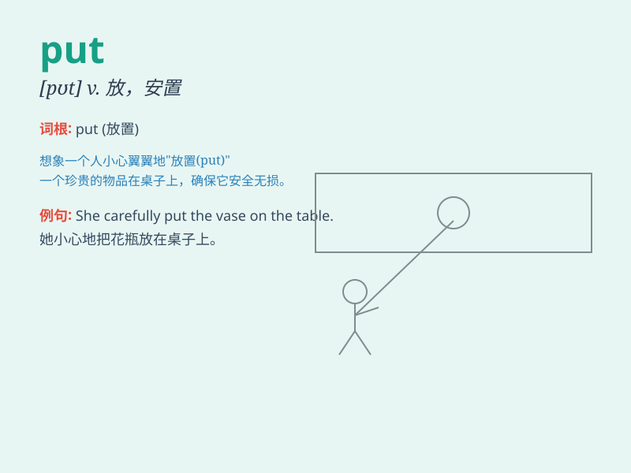

## put

**英音:** _[pʊt]_ **美音:** _[pʊt]_

**译义:**
*vt.放,摆,安置,表达,迫使,移动,提出,赋予vi.出发,航行,发芽,击n.掷,投击,笨蛋,怪人
vbl.put的过去式和过去分词adj.固定不动的*

### 短语

+ **put forward:** _提出；拿出；推举出_

+ **put up:** _建造；举起；张贴；提供住宿_

+ **put off:** _推迟；拖延；搪塞_

+ **put away:** _放好；储存；抛弃；打消_

+ **put on:** _穿上；上演；增加；假装_

### 例句

#### 例句1

> **She put the book on the table.**

**中文翻译:** 她把书放在桌子上。

**单词释义:** 放置

#### 例句2

> **He put on his coat and went out.**

**中文翻译:** 他穿上外套出去了。

**单词释义:** 穿上

#### 例句3

> **Please put your name at the top of the page.**

**中文翻译:** 请把你的名字写在页面顶端。

**单词释义:** 写；写上

### 背诵小故事

> One day, Tom found a beautiful flower. He put it in a vase to make
his room more beautiful. Later, he put his toys away neatly. Put means
to place something in a particular position or to store something
carefully.

**有一天，汤姆发现了一朵漂亮的花。他把它放在花瓶里让房间更漂亮。后来，他把玩具整齐地放好。put
意思是将某物放置在特定位置或仔细存放某物。**

### 图义

