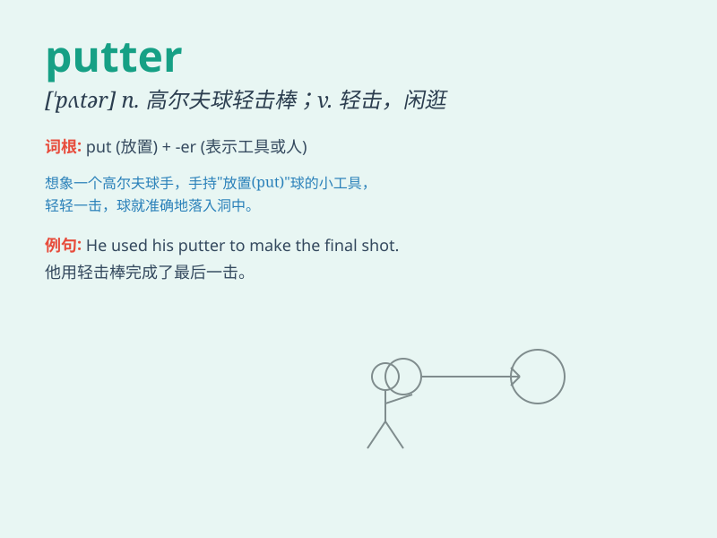

## putter

**英音:** _[\'pʌtə]_ **美音:** _[\'pʌtɚ]_

**译义:** *n.置放者,(高尔夫球)轻击棒vi.闲荡.行为懒散,vt.混过*

### 短语

+ **putter around:** _闲荡；闲逛_

+ **putter along:** _缓慢前进；磨蹭_

+ **golf putter:** _高尔夫球推杆_

+ **putter out:** _熄灭；使筋疲力尽_

+ **putter in:** _投入；花费（时间、精力等）_

### 例句

#### 例句1

> **He spent the morning puttering around the garden.**

**中文翻译:** 他整个上午都在花园里闲逛。

**单词释义:** 闲逛；闲荡

#### 例句2

> **She was puttering in the kitchen, making lunch.**

**中文翻译:** 她在厨房里磨蹭，做午饭。

**单词释义:** 磨蹭；缓慢而轻松地做事

#### 例句3

> **The old man likes to putter in his workshop on weekends.**

**中文翻译:** 这位老人喜欢在周末在他的工作室里鼓捣东西。

**单词释义:** 鼓捣；摆弄

### 背诵小故事

> One day, I was playing golf. I had a special club called a putter.
With the putter, I carefully hit the ball into the hole on the green. It
was so fun using the putter to get a good score!

**有一天，我在打高尔夫球。我有一个特殊的球杆叫推杆。用推杆，我小心翼翼地把球打进果岭上的洞。用推杆取得好成绩太有趣了！**

### 图义

