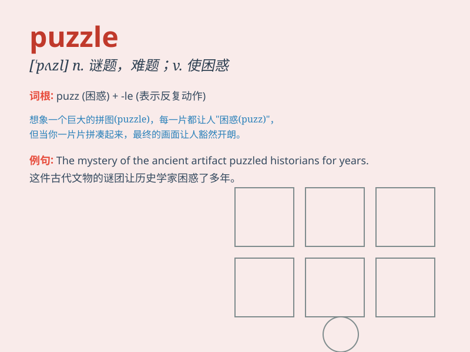

## puzzle

**英音:** _[\'pʌz(ə)l]_ **美音:** _[\'pʌzl]_

**译义:** *n.难题,谜v.(使)迷惑,(使)为难,迷惑不解*

### 短语

+ **puzzle out:** _苦苦思索而弄清楚_

+ **puzzle over:** _对...冥思苦想_

+ **crossword puzzle:** _纵横字谜_

+ **jigsaw puzzle:** _拼图玩具_

+ **puzzle box:** _谜题盒_

### 例句

#### 例句1

> **The puzzle is too difficult for me to solve.**

**中文翻译:** 这个谜题对我来说太难解了。

**单词释义:** 谜题；智力游戏

#### 例句2

> **Her disappearance has been a puzzle to the police.**

**中文翻译:** 她的失踪一直让警方感到困惑。

**单词释义:** 令人困惑的事

#### 例句3

> **He spent hours puzzling over the math problem.**

**中文翻译:** 他花了几个小时苦苦思索那道数学题。

**单词释义:** 苦思；使困惑

### 背诵小故事

> One day, Tom was given a puzzle to solve. It was a picture with many
hidden clues. He spent hours thinking and fitting the pieces together.
Finally, he solved the puzzle and felt very happy.

**一天，汤姆得到了一个谜题去解决。这是一幅有很多隐藏线索的图片。他花了好几个小时思考，把碎片拼在一起。最后，他解开了谜题，感到非常开心。**

### 图义

