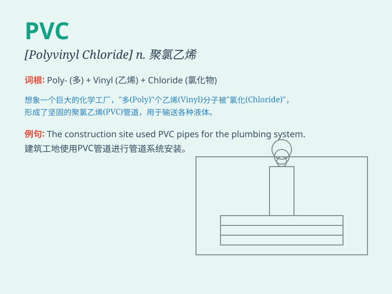

## PVC

**英音:** __ **美音:** __

**译义:** *abbr. 聚氯乙烯（Polyvinyl Chloride）*

### 短语

+ **PVC pipe:** _聚氯乙烯管_

+ **PVC material:** _聚氯乙烯材料_

+ **PVC flooring:** _聚氯乙烯地板_

+ **PVC window:** _聚氯乙烯窗_

+ **PVC sheet:** _聚氯乙烯薄板_

### 例句

#### 例句1

> **The pipes are made of PVC.**

**中文翻译:** 这些管道是由聚氯乙烯制成的。

**单词释义:** 聚氯乙烯（一种塑料材料）

#### 例句2

> **We need to buy some PVC sheets for the project.**

**中文翻译:** 我们需要为这个项目买一些聚氯乙烯板。

**单词释义:** 聚氯乙烯（材料）

#### 例句3

> **The PVC coating makes the wire more durable.**

**中文翻译:** 聚氯乙烯涂层使这根电线更耐用。

**单词释义:** 聚氯乙烯（涂层）

### 背诵小故事

> One day, a little boy was playing in the factory and saw a pipe
labeled \'PVC\'. He asked his father what it meant. His father explained
that PVC is a special material used to make pipes and many useful
things. The boy remembered it easily.

**一天，一个小男孩在工厂里玩耍，看到一根标有"PVC"的管子。他问爸爸这是什么意思。爸爸解释说
PVC
是一种特殊的材料，用来制造管子和很多有用的东西。小男孩很容易就记住了。**

### 图义

