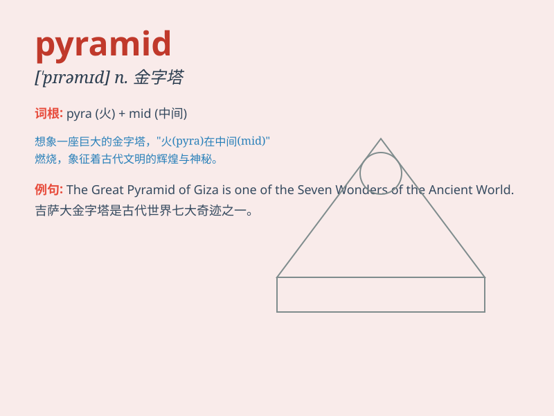

## pyramid

**英音:** _[\'pɪrəmɪd]_ **美音:** _[\'pɪrəmɪd]_

**译义:**
*n.角锥、棱椎,金字塔,叠罗汉v.(使)成金字塔状,(使)渐增,(使)上涨*

### 短语

+ **food pyramid:** _食物金字塔_

+ **pyramid scheme:** _金字塔骗局；非法传销_

+ **the Pyramids of Egypt:** _埃及金字塔_

+ **pyramid selling:** _传销_

+ **energy pyramid:** _能量金字塔_

### 例句

#### 例句1

> **The Pyramids of Egypt are one of the world\'s greatest
wonders.**

**中文翻译:** 埃及金字塔是世界上最伟大的奇迹之一。

**单词释义:** 金字塔

#### 例句2

> **The food was piled up in a pyramid shape on the plate.**

**中文翻译:** 食物在盘子上堆成金字塔形状。

**单词释义:** 金字塔形物体

#### 例句3

> **The sales graph showed a pyramid structure, with a few top
performers and many at the bottom.**

**中文翻译:**
销售图表显示出金字塔结构，其中有一些表现最好的公司，而许多则处于底部。

**单词释义:** 金字塔结构

### 背诵小故事

> Once upon a time, a little ant was lost in a huge pyramid. It climbed
up and down, seeing many rooms and passages. Finally, it found the exit.
Remember, the shape of the pyramid is like this word - pyramid.

**从前，一只小蚂蚁在一个巨大的金字塔里迷路了。它爬上爬下，看到了许多房间和通道。最后，它找到了出口。记住，金字塔的形状就像这个单词 -
pyramid。**

### 图义

