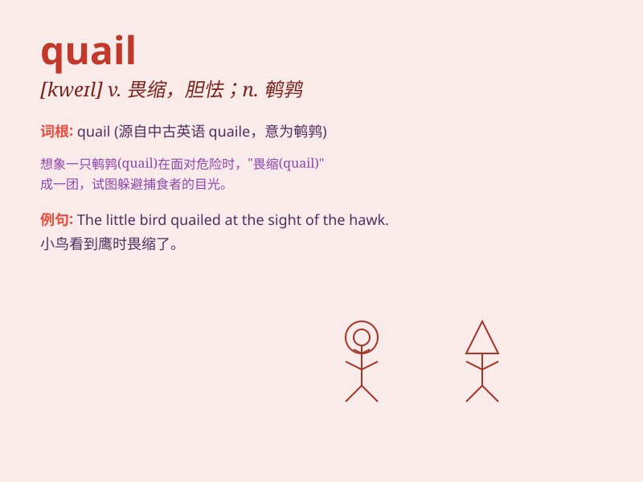

## quail

**英音:** _[kweɪl]_ **美音:** _[kwel]_

**译义:** *v.感到恐惧*

### 短语

+ **quail egg:** _鹌鹑蛋_

+ **quail at:** _畏缩；胆怯_

+ **California quail:** _加州鹌鹑_

+ **mountain quail:** _山鹑_

+ **quail call:** _鹌鹑叫声_

### 例句

#### 例句1

> **The quail darted across the field.**

**中文翻译:** 鹌鹑飞快地穿过田野。

**单词释义:** 鹌鹑（一种鸟）

#### 例句2

> **She quailed at the thought of giving a speech in public.**

**中文翻译:** 一想到要在公开场合发表演讲，她就感到畏缩。

**单词释义:** （因害怕）畏缩，胆怯

#### 例句3

> **His threats did not make her quail.**

**中文翻译:** 他的威胁并没有让她感到畏惧。

**单词释义:** （因威胁等）害怕，胆怯

### 背诵小故事

> A little quail was lost in the forest. It was very scared and wanted
to find its way home. Suddenly, it saw a bright light and followed it.
Finally, it reached home safely. The quail was so happy!

**一只小鹌鹑在森林里迷路了。它非常害怕，想找到回家的路。突然，它看到一道亮光并跟着它。最后，它安全到家了。这只鹌鹑非常高兴！**

### 图义

