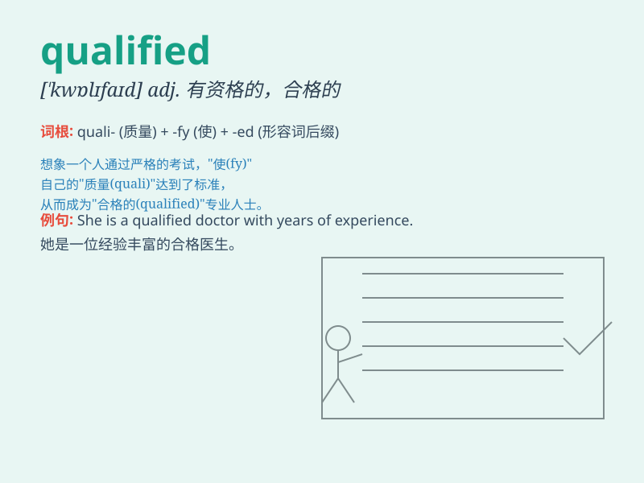

## qualified

**英音:** _[\'kwɒlɪfaɪd]_ **美音:** _[\'kwɑlə\'faɪd]_

**译义:** *adj.有资格的*

### 短语

+ **qualified teacher:** _合格的教师_

+ **qualified candidate:** _合格的候选人_

+ **qualified success:** _有限的成功_

+ **be qualified for:** _有\...\...的资格；胜任\...\..._

+ **qualified approval:** _有保留的赞成_

### 例句

#### 例句1

> **She is a qualified doctor.**

**中文翻译:** 她是一名合格的医生。

**单词释义:** 合格的；有资格的

#### 例句2

> **He is qualified to teach English.**

**中文翻译:** 他有资格教英语。

**单词释义:** 有资格的；能胜任的

#### 例句3

> **The team has qualified for the finals.**

**中文翻译:** 该队已获得决赛资格。

**单词释义:** 获得资格；使具备资格

### 背诵小故事

>
想象一位求职者努力学习和实践，最终通过了一系列严格的考试和面试，获得了
qualified 的评价，意味着他具备了所需的能力和资格，成功得到了理想的工作。

**想象一位求职者通过努力获得'有资格的；合格的'评价并得到工作**

### 图义

