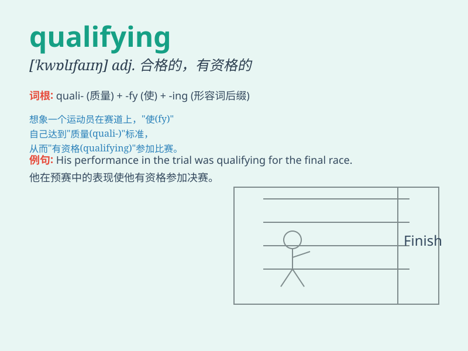

## qualifying

**英音:** _[ˈkwalɪfaɪɪŋ]_ **美音:** _[ˈkwɑlɪfaɪɪŋ]_

**译义:** *adj. 资格的；合格的；n. (某些运动或竞赛中的)资格赛；v.
使具有资格；使胜任（qualify的现在分词形式）*

### 短语

+ **qualifying exam:** _资格考试_

+ **qualifying round:** _资格赛_

+ **qualifying heat:** _预赛_

+ **qualifying criteria:** _资格标准_

+ **qualifying competition:** _资格赛比赛_

### 例句

#### 例句1

> **The athlete performed well in the qualifying round.**

**中文翻译:** 这位运动员在资格赛中表现出色。

**单词释义:** 资格赛的；预选赛的

#### 例句2

> **Qualifying for the scholarship requires a high GPA.**

**中文翻译:** 获得奖学金的资格需要高的平均绩点。

**单词释义:** 使具有资格；取得资格

#### 例句3

> **The team\'s victory in the qualifying match was crucial.**

**中文翻译:** 这个队在预选赛中的胜利至关重要。

**单词释义:** 资格赛的；预选赛的

### 背诵小故事

> In a big race, Tom was in the qualifying round. He ran very fast and
did well to get the chance to enter the final. The qualifying process
was tough but he made it.

**在一场大型比赛中，汤姆参加了资格赛。他跑得很快，表现出色，获得了进入决赛的机会。资格赛的过程很艰难，但他成功了。**

### 图义

